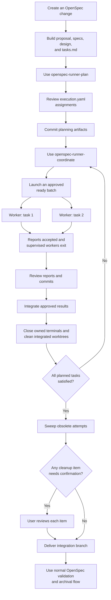
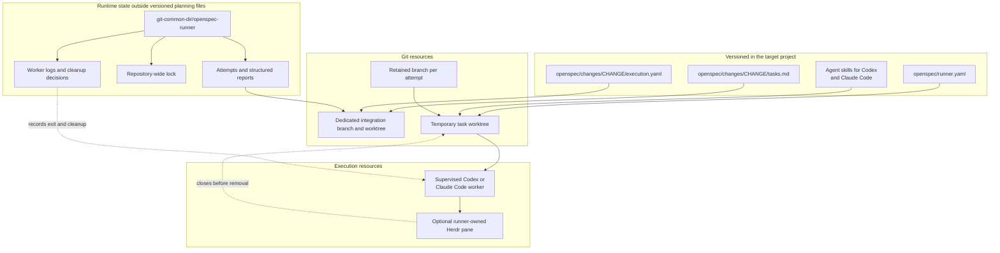
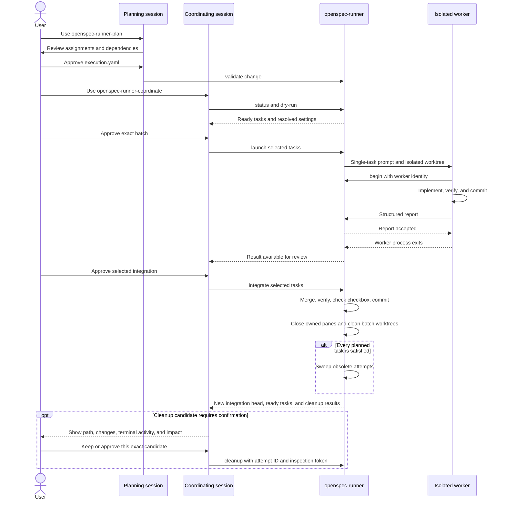
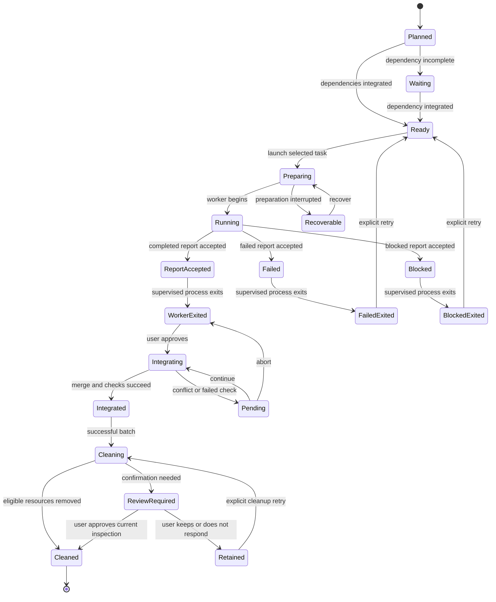

# openspec-runner

`openspec-runner` adds explicit, reviewable parallel execution to an existing
[OpenSpec](https://github.com/Fission-AI/OpenSpec) workflow. It turns selected
checkboxes from an OpenSpec change into isolated Codex or Claude Code worker
sessions, Git branches, and worktrees, then integrates only the results you
approve.

The package installs three project-local agent skills:

| Skill | Where it runs | Responsibility |
|---|---|---|
| `openspec-runner-plan` | Your planning session | Create or complete normal OpenSpec artifacts, assign models and dependencies, and write `execution.yaml` |
| `openspec-runner-coordinate` | Your coordinating session | Validate, preview, launch, inspect, retry, and integrate explicitly selected task batches |
| `openspec-runner-implement` | One isolated worker per task | Implement exactly one checkbox, verify it, commit it, and submit a structured report |

The skills guide both supported worker harnesses; the `openspec-runner` CLI
enforces durable state, dependency, worktree, report, and integration rules.
The runner does not replace OpenSpec, modify OpenSpec core, change Codex or
Claude Code authentication or permissions, or automatically archive a change.

Explicit skill invocation differs by harness:

| Harness | Syntax |
|---|---|
| Codex | `Use $openspec-runner-plan ...` |
| Claude Code | `/openspec-runner-plan ...` |

Use the corresponding skill name for coordination or implementation. Claude
Code can also load a matching skill automatically from its description, but
this guide uses `/skill-name` when explicit invocation matters. Codex examples
use the `$skill-name` mention syntax.

## Contents

- [How it fits into OpenSpec](#how-it-fits-into-openspec)
- [Requirements](#requirements)
- [Install into a target project](#install-into-a-target-project)
- [Quick start](#quick-start)
- [Use the three skills together](#use-the-three-skills-together)
- [Configuration](#configuration)
- [Task lifecycle and integration](#task-lifecycle-and-integration)
- [Sessions, terminals, and worktrees](#sessions-terminals-and-worktrees)
  - [Worktree and terminal cleanup](#worktree-and-terminal-cleanup)
- [Recovery and plan changes](#recovery-and-plan-changes)
- [CLI reference](#cli-reference)
- [State and safety guarantees](#state-and-safety-guarantees)
- [Troubleshooting](#troubleshooting)
- [Developing the runner](#developing-the-runner)

## How it fits into OpenSpec

Keep using OpenSpec to describe a change and produce its normal proposal, design,
specification, and `tasks.md` artifacts. The runner begins where those tasks need
execution metadata and isolated implementation.

The initial OpenSpec artifacts do not need to be committed before using the
`openspec-runner-plan` skill. The planning skill may complete those artifacts
and will add `execution.yaml`, so review and commit the complete planning result
after the skill finishes. That commit is required before coordination can
preview or launch any task.



There are two important boundaries:

1. A worker completing a task does **not** complete its canonical OpenSpec
   checkbox. Only successful integration does that.
2. The runner produces a dedicated integration branch. Delivering that branch
   to your main branch and archiving the OpenSpec change remain explicit steps.

The resulting file and state layout is:



## Requirements

The target project must have:

- Linux, macOS, or WSL. Native Windows is outside v1.
- Node.js 22.13 or newer.
- Git and a Git repository.
- OpenSpec installed and initialized in the project.
- At least one selected worker harness—Codex or Claude Code—installed,
  authenticated, and available on `PATH`.
- The planning artifacts committed before the first launch.

Optional integrations:

- [Worktrunk](https://github.com/max-sixty/worktrunk) for worktree creation. With
  `worktrees: auto`, the runner uses it only when the required capabilities are
  available and otherwise falls back to Git worktrees.
- [Herdr](https://herdr.dev/docs/agent-automation/) for automatic persistent
  terminal sessions. With `terminal: auto`, it is used when `HERDR_ENV=1`;
  Orca takes precedence when both environments are present.
- [stablyai/orca](https://github.com/stablyai/orca) for worktree creation and
  persistent terminals. Select `worktrees: orca` and `terminal: orca`, or use
  terminal auto-detection inside an Orca terminal. Outside either
  environment, the runner prints exact commands for separate terminals.

Check the required tools before installation:

```sh
node --version
git --version
openspec --version
codex --version        # when using Codex
claude --version       # when using Claude Code
```

## Install into a target project

Installation has two parts: make the CLI available, then run `init` in each
target project to install the project-local skills and configuration.

### 1. Build and link the CLI

This repository currently ships as a local companion rather than a registry
package. From the `openspec-runner` checkout:

```sh
cd /path/to/openspec-runner
pnpm install --frozen-lockfile
pnpm run build
pnpm add --global .
```

`pnpm add --global .` exposes the `openspec-runner` executable through your pnpm
global binary directory. Confirm that directory is on `PATH`:

```sh
openspec-runner --help
```

If you do not want a global install, add the local checkout to the target project
instead:

```sh
cd /path/to/target-project
pnpm add --save-dev /path/to/openspec-runner
pnpm exec openspec-runner --help
```

Use `pnpm exec openspec-runner` in place of `openspec-runner` below when using this
local dependency option.

### 2. Initialize the target project

Run `init` from anywhere inside the target Git repository:

```sh
cd /path/to/target-project
openspec-runner init
# or: openspec-runner init --agent claude
# or: openspec-runner init --agent all
```

It creates this project-local installation:

```text
target-project/
├── .agents/
│   └── skills/
│       ├── openspec-runner-plan/SKILL.md
│       ├── openspec-runner-coordinate/SKILL.md
│       └── openspec-runner-implement/SKILL.md
├── .claude/
│   └── skills/              # installed by init --agent claude|all
└── openspec/
    └── runner.yaml
```

`init` is safe to rerun after rebuilding or upgrading the runner. `codex` remains
the compatibility default; `claude` creates a version-2 config with an explicit
`sonnet` default and `dontAsk` permissions; `all` installs both skill targets and
allows `--default-agent codex|claude` for a new version-2 config:

- It updates only the three runner-owned `SKILL.md` files.
- It does not remove or replace unrelated project skills.
- It creates `openspec/runner.yaml` only when absent, preserving existing runner
  configuration.
- It does not initialize OpenSpec or create an OpenSpec change.

Review and commit the installed files so every task worktree receives the same
skills and configuration:

```sh
git add .agents/skills/openspec-runner-* .claude/skills/openspec-runner-* openspec/runner.yaml
git commit -m "Install OpenSpec runner skills"
```

After upgrading this checkout, rebuild, rerun `openspec-runner init` in the
target project, review the skill changes, and commit them.

## Quick start

Assume an existing OpenSpec change named `user-auth`.

### 1. Plan the execution

Invoke the planning skill with the syntax for your coordinator.

Codex:

```text
Use $openspec-runner-plan for the user-auth change. Complete any missing OpenSpec
artifacts, then propose task dependencies, model assignments, effort, and safe
parallel groups. Do not launch anything yet.
```

Claude Code:

```text
/openspec-runner-plan user-auth. Complete any missing OpenSpec artifacts, then
propose task dependencies, model assignments, effort, and safe parallel groups.
Do not launch anything yet.
```

Review the proposed table. After approval, the skill writes
`openspec/changes/user-auth/execution.yaml` beside `tasks.md`, validates the
plan, and asks you to commit the planning artifacts. You may start this step
with uncommitted proposal, design, specification, or `tasks.md` files; commit
them together with `execution.yaml` after planning finishes and before starting
step 2.

### 2. Inspect and preview a ready batch

Codex:

```text
Use $openspec-runner-coordinate for user-auth. Show ready tasks and preview tasks
1.1 and 1.2. Do not launch until I approve the preview.
```

Claude Code:

```text
/openspec-runner-coordinate user-auth. Show ready tasks and preview tasks 1.1
and 1.2. Do not launch until I approve the preview.
```

The coordinating session runs the equivalent of:

```sh
openspec-runner status user-auth --json
openspec-runner launch user-auth --tasks 1.1,1.2 --dry-run --json
```

The preview resolves the base commit, dependencies, parallel permission, model,
and reasoning effort before creating resources.

### 3. Launch the approved tasks

After reviewing the preview, tell the coordinating session to launch that exact
batch. It runs:

```sh
openspec-runner launch user-auth --tasks 1.1,1.2
```

Inside Herdr, each task starts in its own persistent workspace; inside Orca,
each starts in its own terminal. Outside these environments,
the command prints one shell-quoted supervised worker command per task; run each
command once in a separate terminal. Reserved attempts already consume
concurrency slots, so do not rerun `launch` just because a terminal has not
started yet.

The selected harness comes from `defaultAgent`, the change-level `agent`, or
`--agent`. For example, an approved Claude Code batch can be launched with:

```sh
openspec-runner launch user-auth --tasks 1.1,1.2 --agent claude
```

### 4. Review and integrate

Each worker uses the `openspec-runner-implement` skill through a
harness-specific runner-generated prompt: `$openspec-runner-implement` for
Codex and `/openspec-runner-implement` for Claude Code. It implements one
checkbox, verifies and commits it, then submits a structured report. Back in
the coordinating session:

```sh
openspec-runner status user-auth --json
openspec-runner integrate user-auth --tasks 1.1,1.2
```

Review the report, verification evidence, commit, and worktree before approving
integration. Integration waits until every selected supervised worker has
actually exited; an accepted report by itself is not sufficient. Successful
integration merges tasks sequentially, runs configured checks, updates the
corresponding checkboxes, and commits those updates in the dedicated integration
worktree. It then returns a cleanup summary. With the default automatic policy,
eligible task terminals and worktrees from that successful batch are cleaned at
this point.

### 5. Continue with newly ready tasks

Dependencies are satisfied only after integration. If task `2.1` depends on
both previous tasks:

```sh
openspec-runner launch user-auth --tasks 2.1 --dry-run --json
openspec-runner launch user-auth --tasks 2.1
openspec-runner integrate user-auth --tasks 2.1
```

Repeat until complete, then explicitly deliver the returned integration branch
and use your normal OpenSpec validation and archival process.

## Use the three skills together

### Planning skill: `openspec-runner-plan`

Use this while creating a change or adding runner metadata to an existing change.
It:

1. Uses the repository's existing `openspec status` and artifact-instruction
   workflow to create missing artifacts in dependency order.
2. Keeps standard numbered checkboxes in `tasks.md`.
3. Queries `openspec-runner models --json` instead of assuming model IDs.
4. Presents one review table with task number, description, model, optional
   reasoning effort, dependencies, and parallel permission.
5. Writes `execution.yaml` after review, includes every checkbox, and runs
   `openspec-runner validate <change> --json`.

Task identity comes from the number in the checkbox text:

```markdown
- [ ] 1.1 Add the token verifier
- [ ] 1.2 Add the session repository
- [ ] 2.1 Wire authentication into the API
```

Do not use OpenSpec's positional JSON task IDs as runner identifiers. Every
checkbox must have an entry in `execution.yaml`; an empty assignment is valid.

Planning does not authorize a launch. The OpenSpec artifacts may be uncommitted
when planning starts. After planning finishes, commit `tasks.md`,
`execution.yaml`, and every other changed OpenSpec artifact before moving to
coordination.

### Coordination skill: `openspec-runner-coordinate`

Use one coordinating session to own the batch lifecycle. It:

- Shows status and ready tasks before launch.
- Previews the exact selected batch with `--dry-run --json`.
- Launches only that batch; it never starts a continuous scheduler.
- Uses `attach` for an existing worker instead of creating duplicates.
- Treats structured worker reports, not terminal idle indicators, as completion.
- Integrates only results selected after review.
- Stops on conflicts or failed checks and uses explicit continue/abort recovery.
- Reports automatic cleanup results and asks about candidates requiring a user
  decision. Attempt branches and the integration worktree remain available.

A useful prompt for later batches is:

Codex:

```text
Use $openspec-runner-coordinate for user-auth. Inspect current status, show the
reports for completed workers, and propose the next dependency-ready batch. Wait
for my choice before integrating or launching.
```

Claude Code:

```text
/openspec-runner-coordinate user-auth. Inspect current status, show the reports
for completed workers, and propose the next dependency-ready batch. Wait for my
choice before integrating or launching.
```

### Implementation skill: `openspec-runner-implement`

Normally you do not invoke this yourself. The runner includes it in the
single-task prompt sent to every worker, using Codex's `$skill-name` syntax or
Claude Code's `/skill-name` syntax as appropriate. A worker must:

1. Register its worker identity from the assigned worktree with `begin`: Codex
   uses its actual `CODEX_THREAD_ID`; Claude Code uses the reserved stream UUID.
2. Read the change artifacts and implement only its assigned checkbox.
3. Leave `tasks.md`, `execution.yaml`, `runner.yaml`, and other shared
   planning artifacts unchanged.
4. Perform task-specific verification and commit the implementation.
5. Keep a completed worktree clean at the reported commit.
6. Write its report outside the worktree and submit it with `report`.
7. After the report command returns successfully, end the turn so the supervised
   worker exits instead of continuing to another checkbox.

The runner-generated prompt supplies the change, task number, and attempt ID. The
worker-facing sequence is conceptually:

```sh
openspec-runner begin user-auth 1.1 --attempt ATTEMPT_ID
# implement only task 1.1, verify, and commit
openspec-runner report user-auth 1.1 \
  --attempt ATTEMPT_ID \
  --file /absolute/path/outside/worktree/task-report.json
```

A completed report has this shape:

```json
{
  "attempt": "supplied-attempt-id",
  "task": "1.1",
  "session": "worker-session-id",
  "outcome": "completed",
  "commit": "full-HEAD-commit-SHA",
  "summary": "Added token verification and covered rejection paths",
  "verification": ["pnpm test -- token-verifier: 8 tests passed"]
}
```

`outcome` may be `completed`, `failed`, or `blocked`. Verification must be a
nonempty array of concrete evidence. Completed reports require the full commit
SHA. Codex reports its registered thread identity; Claude Code reports the
matching stream `session_id`. A blocked or failed worker has stopped
implementing; start a new attempt only with explicit `retry`.

### Skill handoff sequence



## Configuration

### Project configuration: `openspec/runner.yaml`

`init` creates:

```yaml
version: 1
defaultModel: session
maxParallel: 4
worktrees: auto
terminal: auto
cleanup: automatic
setup: []
verifyIntegration: []
```

| Field | Meaning |
|---|---|
| `version` | Configuration schema version; currently `1` |
| `defaultModel` | `session` to inherit the coordinating Codex session, or an explicit model identifier |
| `maxParallel` | Repository-wide maximum active/reserved task attempts |
| `worktrees` | `auto` uses compatible Worktrunk when available, otherwise Git; explicit `git`, `worktrunk`, and `orca` are supported |
| `terminal` | `auto` uses Orca when `ORCA_TERMINAL_HANDLE` is present, then Herdr inside Herdr, otherwise returns manual commands; explicit `orca`, `herdr`, and `manual` are supported |
| `cleanup` | `automatic` (default, including existing configs) cleans successful batches and completed changes; `manual` retains terminals/worktrees until explicit cleanup |
| `setup` | Idempotent argument-array commands run while preparing task worktrees |
| `verifyIntegration` | Argument-array commands run after merging into the integration worktree |

For example:

```yaml
version: 1
defaultModel: session
maxParallel: 3
worktrees: auto
terminal: auto
cleanup: automatic
setup:
  - ["pnpm", "install", "--frozen-lockfile", "--prefer-offline"]
verifyIntegration:
  - ["pnpm", "test"]
  - ["pnpm", "run", "build"]
```

Commands are argument arrays, not shell strings. Keep `setup` idempotent because
recovery can explicitly rerun unfinished setup. Integration checks must not leave
unexplained unstaged or untracked files.

New projects can select a harness with version 2:

```yaml
version: 2
defaultAgent: claude
agents:
  claude:
    defaultModel: sonnet
    permissionMode: dontAsk
    allowedTools: []
    # Optional reviewed supplement:
    # planningRules: openspec/planning-rules/claude.md
maxParallel: 4
worktrees: auto
terminal: auto
cleanup: automatic
setup: []
verifyIntegration: []
```

`defaultAgent` is the project fallback; a launch batch may select another
registered harness with `--agent`. Each batch is homogeneous, while separate
batches may use different harnesses. `agents.<harness>` owns that harness's
model, permission, and planning-rule settings. `allowedTools: []` grants
nothing, and the runner never injects a permission bypass.

### Per-change assignments: `execution.yaml`

Place `execution.yaml` beside the change's `tasks.md`:

```yaml
version: 1
tasks:
  "1.1":
    parallel: true
  "1.2":
    model: session
    reasoningEffort: high
    parallel: true
  "2.1":
    dependsOn: ["1.1", "1.2"]
    parallel: false
```

| Field | Meaning |
|---|---|
| `model` | Model identifier, or `session`; omission also inherits the launch session |
| `reasoningEffort` | Optional effort supported by the selected model |
| `dependsOn` | Task numbers that must be integrated before launch |
| `parallel` | Whether the task may overlap other explicitly parallel tasks; omission is `false` |

Dependencies must reference existing tasks and the graph must be acyclic.
Previously completed checkboxes in the initial committed baseline count as
satisfied.

Version 2 assigns one change-level harness and uses the common `effort` field:

```yaml
version: 2
agent: claude
tasks:
  "1.1":
    model: sonnet
    parallel: true
  "1.2":
    model: sonnet
    effort: high
    parallel: true
```

Task-level `agent` fields are rejected. Version-1 files remain Codex-compatible
and are normalized as Codex at runtime; old and new schemas are never silently
translated between harnesses.

### Model and effort resolution

Inspect models and aliases through the selected harness with:

```sh
openspec-runner models --json
openspec-runner models --agent claude --json
openspec-runner planning-rules --agent claude --json
```

Model IDs are configurable and not hard-coded by the skills. At batch launch:

- An omitted model uses the selected harness's configured/default model. `session`
  means calling-session inheritance; it is supported for Codex and intentionally
  unavailable for Claude until a stable reader exists.
- An explicitly different model uses its advertised default effort unless
  an effort is assigned. Claude may intentionally omit effort and use its
  CLI/model default.
- An explicit assignment matching the inherited model inherits its effort.
- If calling-session metadata is unavailable, supply explicit defaults:

```sh
openspec-runner launch user-auth --tasks 1.1 \
  --default-model MODEL_ID \
  --default-effort high
```

The isolated Codex metadata reader currently supports Codex CLI 0.153.x and the
`state_5.sqlite` threads schema, tested with 0.153.4. It selects only `model`
and `reasoning_effort` for `CODEX_THREAD_ID` through a read-only connection;
it does not read messages, titles, authentication, or unrelated threads.
Unsupported formats fail with an explicit-default instruction. Claude uses print
mode with structured `stream-json`, a preallocated `--session-id`, and exact
`--resume` only after stream identity confirmation. Credentials remain in the
user's CLI configuration and are never copied into runner state. Resolved
settings and the immutable harness are saved with attempts, so later model or
calling-session changes do not alter resume behavior.

## Task lifecycle and integration



### Readiness and parallelism

A task is ready only when all dependencies are integrated. Completion alone does
not unlock dependents. Launch accepts exactly the comma-separated task numbers
you select and does not automatically fill unused capacity.

Overlapping tasks may run together only when every overlapping task has
`parallel: true`. A task with `parallel: false` runs alone. `maxParallel`
and the repository lock cover all changes sharing the Git common directory.

### Base and branch behavior

The first launch creates a dedicated integration branch and worktree. Its base is
the invoking checkout's committed `HEAD` unless `--base REF` is supplied:

```sh
openspec-runner launch user-auth --tasks 1.1 --base origin/main
```

The selected base must contain identical planning artifacts. Later batches start
from the recorded integration head. Unrelated uncommitted changes in the invoking
checkout stay there and are not included.

### Integration behavior

Before merging a result, the runner verifies:

- The report belongs to the current attempt and task.
- The reported commit is the task worktree's current commit.
- The task worktree is clean.
- Planning artifacts still match their recorded fingerprints.

It merges selected results sequentially, runs `verifyIntegration`, changes only
the integrated tasks' checkboxes, and commits in the integration worktree. The
invoking checkout stays on its original branch.

If a merge conflicts or a check fails, the transaction remains pending and
dependents stay blocked. Inspect the returned integration path. Resolve and stage
conflicts, or fix the failed check, then run:

```sh
openspec-runner integrate user-auth --continue
```

To discard the pending transaction's tracked changes:

```sh
openspec-runner integrate user-auth --abort
```

Abort restores the transaction's starting tracked state. Earlier integrations,
task branches, and task worktrees remain. If the coordinator crashed immediately
after its merge commit, `--continue` recognizes that commit without duplicating
it.

## Sessions, terminals, and worktrees

### Inside Herdr

For every task, the runner creates a labeled workspace without changing focus,
starts a supervised Codex or Claude worker in the returned pane with explicit
settings and working directory. Workspace, pane, terminal, batch, harness, and
worker session IDs are saved when available.

```sh
openspec-runner attach user-auth 1.1
```

While a worker is active, `attach` focuses its saved pane. After the worker exits
or its worktree is removed, `attach` returns the retained session, branch, log,
and available inspection details instead of trying to resume in a missing
directory. Herdr preserves panes across client detach and reconnect. A server or
machine restart may require the exact saved Codex or Claude resume command. Herdr idle/done
indicators describe terminal activity, not task completion.

### Inside Orca (stablyai/orca)

Use the [Orca desktop app](https://github.com/stablyai/orca) from
[onorca.dev](https://www.onorca.dev/). Register its `orca` CLI in the app's
settings and add the target repository to Orca. In `openspec/runner.yaml`, select:

```yaml
worktrees: orca
terminal: orca
```

Check `orca status --host local --json` before launching. Explicit `terminal:
orca` works from any shell with access to the ready local runtime. `terminal:
auto` detects Orca through `ORCA_TERMINAL_HANDLE`. Each selected task gets a
dedicated background terminal running the saved supervised Codex or Claude
worker command. It does not send prompts into an existing interactive agent.

The worktree adapter calls `orca worktree create --base-branch <commit> --setup
skip --no-parent`. It records Orca's actual branch and path, which follow the
app's workspace and branch-prefix settings, and verifies the base against local
Git. A unique attempt marker in the worktree comment supports reconciliation
after a partial creation failure; retain that comment until preparation finishes.
The internal integration worktree continues to use Git directly. Runner `setup`
commands still run normally; Orca setup commands are skipped.

`attach` focuses the saved terminal handle. Runtime and PTY incarnation identities
prevent attaching to or closing a replacement terminal. Ambiguous terminal
creation is never automatically resubmitted. After a runtime restart, inspect
the saved attempt and logs manually; the runner does not adopt fresh handles.

Cleanup saves output and closes only its verified terminal after both the worker
receipt and Orca confirm exit. Other Orca terminals in the task worktree block
removal, including initial shell/default tabs that Orca may create. Inspect and
close those in the app, then retry runner cleanup. Worktree removal uses Git to
retain branches: Orca's `worktree rm` can delete them. Orca may need a workspace
refresh to reflect the external removal. No unrelated terminals are closed.

`worktrees: auto` retains its Worktrunk/Git behavior. The two adapter settings
are independent; Orca terminals also work with Git/Worktrunk worktrees once
Orca can resolve their paths. This integration requires a local runtime on the
same host and filesystem as the runner. Remote/SSH targets and WSL-to-Windows
app bridging are unsupported. Native Windows remains outside runner support;
use Linux, macOS, or an Orca runtime inside the same WSL environment.

The CLI contract was checked against upstream revision
[`fa0010e8`](https://github.com/stablyai/orca/tree/fa0010e8d6b2a7ad946fe1f1b005c6a8497c6c17).
Older runtimes without host coverage or terminal incarnation information fail
closed. Previous tmux-based `fmfsaisai/orca` support has been replaced; its saved
terminal records require manual inspection and are not migrated into desktop Orca.

### Outside Herdr or Orca

`launch` returns exact supervised worker commands to run once in separate
terminals. Each command starts `openspec-runner worker`, which in turn runs one
selected-harness CLI with the saved prompt and working directory. Claude prompts
are sent through stdin in print/stream-json mode; its session UUID is checked
against emitted stream events. Do not replace it with
an unrequested background process or invoke it twice. While the worker remains
active, `attach` prints the saved resume command instead of focusing a pane.

An attempt without a saved harness identity cannot be recreated blindly after an
ambiguous startup. Inspect its saved workspace/pane or explicitly recover the
appropriate lifecycle stage.

### Worktree and terminal cleanup

With `cleanup: automatic` (the default for new and existing configuration), the
runner performs two cleanup phases:

1. **After each integrated batch:** only after every selected merge and
   integration check succeeds—including an `integrate --continue` recovery—the
   runner considers that batch's integrated attempts. A conflict, failed check,
   or unacknowledged worker exit retains the worktrees needed for recovery.
2. **After the whole change is complete:** when every planned task was already
   complete in the baseline or has been integrated, and no attempt or integration
   transaction is active, the runner sweeps all recorded attempts. This catches
   obsolete failed, blocked, stale, invalidated, and superseded retry worktrees.

The integration worktree is excluded from both phases and stays available for
explicit branch delivery and OpenSpec archival.

New workers use supervised Codex or Claude processes: after an accepted final
report they end their turn, exit, and the supervisor records the actual exit.
Sessions persist in the selected provider and runner logs live under the Git
common directory's `openspec-runner/logs`.
Report acceptance alone is not proof of exit. A worker that exits without an
accepted report is marked failed for explicit retry. No automatic process killing
or guessed terminal input is used.

Before removal, cleanup closes the verified runner-owned Herdr pane and saves
available scrollback. It checks pane identity and foreground activity; on Linux
it also checks shell descendants for background jobs. Unsupported inspection or
uncertain identity leaves a pending action. Close manually opened terminals
yourself before confirming their worktree removal.

Dirty, locked, or changed worktrees require approval. The interactive CLI asks
for each candidate; JSON/unattended calls return `confirmation-required` with
reasons, changed paths, and an approval token for the coordinator to present to
the user. No reply means keep. Approval covers only that attempt and inspected
state; changed files, HEAD, lock, or terminal activity invalidate it. Main,
invoking, integration, active, and unrelated worktrees are protected. Ignored
build/dependency files disappear with the removed directory. Branches, commits,
reports, and session identities remain.

Cleanup reports one status per attempt:

| Status | Meaning and next action |
|---|---|
| `eligible` | Inspection found no review condition. A dry run would remove it; a real cleanup proceeds automatically. |
| `removed` | The verified terminal was closed when applicable and the worktree was removed. |
| `already-removed` | No registered worktree or residual path remains; no action is needed. |
| `confirmation-required` | Removal could discard changes or close a reviewed terminal. Show the path, reasons, changes, and terminal details to the user, then keep it or submit its token. |
| `skipped` | A hard protection or uncertain identity prevents automated removal. Resolve the stated reason before retrying; confirmation does not override this status. |
| `failed` | Closing the terminal or removing the worktree failed. Integration remains successful; inspect the reason and retry cleanup. |

Inspect or retry cleanup, including after archival in the main checkout:

```sh
openspec-runner cleanup user-auth --tasks 1.1,1.2
openspec-runner cleanup user-auth --all --dry-run --json
openspec-runner cleanup user-auth --all
# After the user approves one reviewed candidate:
openspec-runner cleanup user-auth --all --attempt ATTEMPT_ID --confirm TOKEN --json
```

For automation, first inspect with `--dry-run --json`. A review case resembles:

```json
{
  "cleaned": false,
  "branchesRetained": true,
  "scope": { "all": true, "tasks": [] },
  "results": [
    {
      "attempt": "attempt-id",
      "task": "1.1",
      "path": "/absolute/path/to/task-worktree",
      "status": "confirmation-required",
      "reasons": ["Deletion discards the listed tracked/untracked local changes"],
      "changes": "?? notes.txt",
      "terminal": { "kind": "manual", "reason": "Confirm the worker has exited and all manually opened terminals/processes using this worktree have been closed" },
      "token": "state-bound-approval-token"
    }
  ]
}
```

The token is deliberately bound to that inspection. Re-run the dry run and ask
again if the worktree contents, HEAD, lock, integration state, or terminal state
changes before confirmation. Never cache or broadly reuse cleanup tokens.

`--all` requires proof that all planned tasks are satisfied and no attempts are
active. Cleanup failures are reported separately and never turn successful
integration into failure. Set `cleanup: manual` to retain terminals/worktrees
until explicit cleanup; workers still exit after reporting. `attach` returns
inspection details for finished workers instead of attempting to resume them
in removed directories. Old interactive sessions require review before cleanup.

## Recovery and plan changes

### Interrupted preparation

Attempts are persisted before external worktree, setup, or terminal side effects.
If preparation was interrupted before terminal launch was attempted:

```sh
openspec-runner recover user-auth 1.1
```

Recovery reuses the attempt identity, branch, and worktree. It may rerun unfinished
setup commands. Ambiguous Herdr/Orca creation, selected-harness startup, or prompt
submission never causes automatic resubmission. Worktrunk partial creation is
reconciled against Git's worktree list before fallback.

### Failed, blocked, stale, or invalidated attempts

After confirming the old worker has stopped, create a retained new attempt:

```sh
openspec-runner retry user-auth 1.1
```

Retry never terminates the prior worker. Use `attach` to inspect an existing
session; do not continue implementation after a final blocked or failed report.

### Planning artifacts changed

After committed planning content changes and once no attempt or integration is
active, run:

```sh
openspec-runner reconcile user-auth
```

Reconciliation adopts committed plan edits, preserves satisfied task identities,
copies only planning files into the integration worktree, and conservatively
invalidates every unintegrated result. Retry invalidated tasks explicitly.
Checkbox completion changes alone do not invalidate fingerprints.

## CLI reference

| Command | Purpose |
|---|---|
| `init [--agent codex\|claude\|all]` | Create `runner.yaml` when absent and install selected project skills |
| `models [--agent HARNESS] [--json]` | Query the selected harness model capabilities; Claude discovery is explicitly non-exhaustive |
| `planning-rules --agent HARNESS [--json]` | Show bundled and configured versioned planning guidance with hashes |
| `validate <change> [--json]` | Validate task numbering, coverage, dependencies, and OpenSpec readiness |
| `status <change> [--json]` | Inspect readiness, attempts, reports, and sessions |
| `launch <change> --tasks IDS [--agent HARNESS]` | Launch exactly the selected tasks through one harness |
| `launch ... --dry-run --json` | Preview without creating resources |
| `launch ... --default-model MODEL` | Override the inherited/default model |
| `launch ... --default-effort EFFORT` | Override effort for inherited tasks |
| `launch ... --base REF` | Set the initial committed base; default is invoking `HEAD` |
| `attach <change> <task>` | Focus a saved pane or print a resume command |
| `integrate <change> --tasks IDS` | Merge and verify selected completed results |
| `integrate <change> --continue` | Continue pending integration recovery |
| `integrate <change> --abort` | Abort the current pending integration |
| `recover <change> <task>` | Resume interrupted pre-session preparation |
| `retry <change> <task>` | Create a new retained attempt |
| `reconcile <change>` | Adopt committed plan edits and invalidate old results |
| `cleanup <change> --tasks IDS` | Remove selected integrated clean worktrees |
| `cleanup <change> --all [--dry-run] [--json]` | Inspect/retry the final sweep of all attempts |
| `cleanup ... --attempt ID --confirm TOKEN` | Apply approval to one inspected candidate |
| `worker <change> <task> --attempt ID` | Run the returned supervised worker command exactly once |
| `begin <change> <task> --attempt ID [--session ID]` | Worker-only identity registration |
| `report <change> <task> --attempt ID --file PATH` | Worker-only outcome submission |

Prefer `--json` for automation and skill workflows. `launch --dry-run` is the
safe inspection point before worktrees, attempts, or sessions are created.

## State and safety guarantees

- Only explicit task selections launch, integrate, retry, or clean up.
- Every batch records one immutable harness and every attempt records that batch;
  a retry may select another harness only after the previous attempt is stopped.
- The runner does not continuously schedule newly ready tasks.
- Only integration updates canonical OpenSpec task checkboxes.
- Workers cannot claim completion without verification evidence, a full commit
  SHA, and a clean worktree at that commit.
- Shared planning artifacts are fingerprinted; drift blocks unsafe operations
  until explicit reconciliation.
- Runtime state lives under `<git-common-dir>/openspec-runner`, outside versioned
  planning files.
- Concurrency and duplicate prevention use a repository-wide lock shared across
  worktrees and changes.
- Ambiguous external side effects are recorded and not blindly repeated.
- Claude workers use `--session-id` plus matching stream identity and terminal
  evidence; a reserved UUID alone is not proof of a live session or completion.
- Automatic cleanup removes only verified runner-owned task worktrees; review
  conditions require an exact, state-bound user confirmation.
- Cleanup failure is reported independently and does not undo or misreport a
  successful integration.
- Final delivery, branch deletion, and OpenSpec archival are never implicit.

The lock records PID and host. After a coordinator crash, confirm its owner is
gone before explicitly removing
`<git-common-dir>/openspec-runner/lock.json`. Lock stealing is deliberately not
automatic because it could race another coordinator.

## Troubleshooting

### `init` says this is not a Git repository

Run it inside the intended target repository. `init` resolves the Git root before
installing configuration or skills.

### Codex cannot see the runner skills

Confirm the files exist under `.agents/skills/`, commit them, and start or
refresh the Codex session from the target project. Rerun `openspec-runner init`
after upgrading the runner checkout.

### Claude Code cannot see the runner skills or start unattended

Use `openspec-runner init --agent claude` (or `--agent all`) and commit
`.claude/skills/`. Claude must be installed and authenticated separately. The
runner uses `-p --output-format stream-json --verbose`, sends the prompt on
stdin, and starts the prompt with `/openspec-runner-implement`. It deliberately
does not use `--bare`, which skips project skill discovery. The runner uses the
configured permission mode and `allowedTools`; it never injects
`--dangerously-skip-permissions`. A Claude worker cannot inherit a calling
Codex model, so use `--default-model` or an explicit task model.

### Claude reports a session or terminal-evidence error

The UUID passed to `--session-id` is only a reservation. The stream must emit
the same `session_id`, the worker must register it with `begin --session`, and a
terminal result event must be observed before a completed report can be
integrated. Inspect the retained log and retry explicitly after diagnosing a
CLI, permission, or model failure.

### Launch cannot read the calling session model

Use explicit defaults, or assign models and efforts in `execution.yaml`:

```sh
openspec-runner launch user-auth --tasks 1.1 \
  --default-model MODEL_ID \
  --default-effort high
```

### A dependency still appears blocked

Check `openspec-runner status <change> --json`. A report is not enough; the
dependency must be integrated. A pending conflict or failed check also blocks
dependents.

### Launch printed commands instead of opening sessions

This is the expected fallback outside Herdr or Orca. Run each returned command once in
its own terminal. Invoke coordination inside Herdr with `HERDR_ENV=1` for
automatic persistent sessions.

### A worker pane disappeared or the client reconnected

Run `openspec-runner attach <change> <task>`. It focuses a recognized Herdr agent
or prints the exact saved resume command. Do not relaunch unless the lifecycle
explicitly permits `retry`.

### Integration stopped

Inspect the returned integration worktree. Resolve and stage conflicts or fix the
verification failure, then use `integrate --continue`. Use `integrate --abort`
to discard the current pending transaction.

### A task reported completion but integration says its worker has not exited

The structured report was accepted, but the supervised Codex or Claude process has
not yet returned and recorded its exit. Inspect it with `status` and `attach`.
Ask the worker to end its turn if it is still active; do not kill it or integrate
the worktree while the exit is uncertain. Once the supervisor records the exit,
run `integrate` again.

### Cleanup requires confirmation

Inspect the exact candidate and present its path, reasons, changed files, and
terminal activity to the user:

```sh
openspec-runner cleanup <change> --all --dry-run --json
```

An empty response or a decision to keep means no deletion. After an explicit
approval, submit only that attempt's current token. If confirmation fails because
state changed, inspect again and request a new decision rather than reusing the
old token.

### Cleanup was skipped or failed

Read the per-attempt `reasons` in JSON output. `skipped` usually means a protected
path, active transaction, moved worktree, mismatched ownership, or unavailable
terminal inspection; fix that condition before retrying. `failed` means an
eligible or approved operation was attempted but did not finish. The integration
commit remains valid in both cases, and the worktree is retained unless removal
was acknowledged.

### Validation reports plan drift

Commit intended planning edits, let active work and pending integration finish,
then use `reconcile`. Expect unintegrated results to be invalidated and require
explicit retry.

## Developing the runner

From this repository:

```sh
pnpm install --frozen-lockfile
pnpm run build
pnpm test
pnpm pack --dry-run
```

Tests use temporary repositories and fake Codex, Claude Code, Worktrunk, and
Herdr executables.
The compatibility test uses installed OpenSpec when available and otherwise
skips. Coverage includes model inheritance, validation, concurrency, duplicate
prevention, setup recovery, paths containing spaces, partial worktree creation,
Herdr IDs and argument forwarding, stale reports, plan drift, integration
conflicts, failed checks, and interrupted integration commits.

Live acceptance is still recommended in a disposable repository: run the same
scenario once with Codex and once with Claude Code. Plan two independent tasks
and one dependent task, launch the independent workers, detach and reattach,
inspect reports, integrate them, then launch the dependent task. Confirm that
only integration changes canonical checkboxes.

Adapter references: [Codex CLI](https://learn.chatgpt.com/docs/developer-commands?surface=cli),
[Claude Code headless mode](https://code.claude.com/docs/en/headless),
[Claude Code permission modes](https://code.claude.com/docs/en/permission-modes),
[Worktrunk](https://github.com/max-sixty/worktrunk),
[Herdr automation](https://herdr.dev/docs/agent-automation/), and
[Herdr persistence](https://herdr.dev/docs/persistence-remote/).
