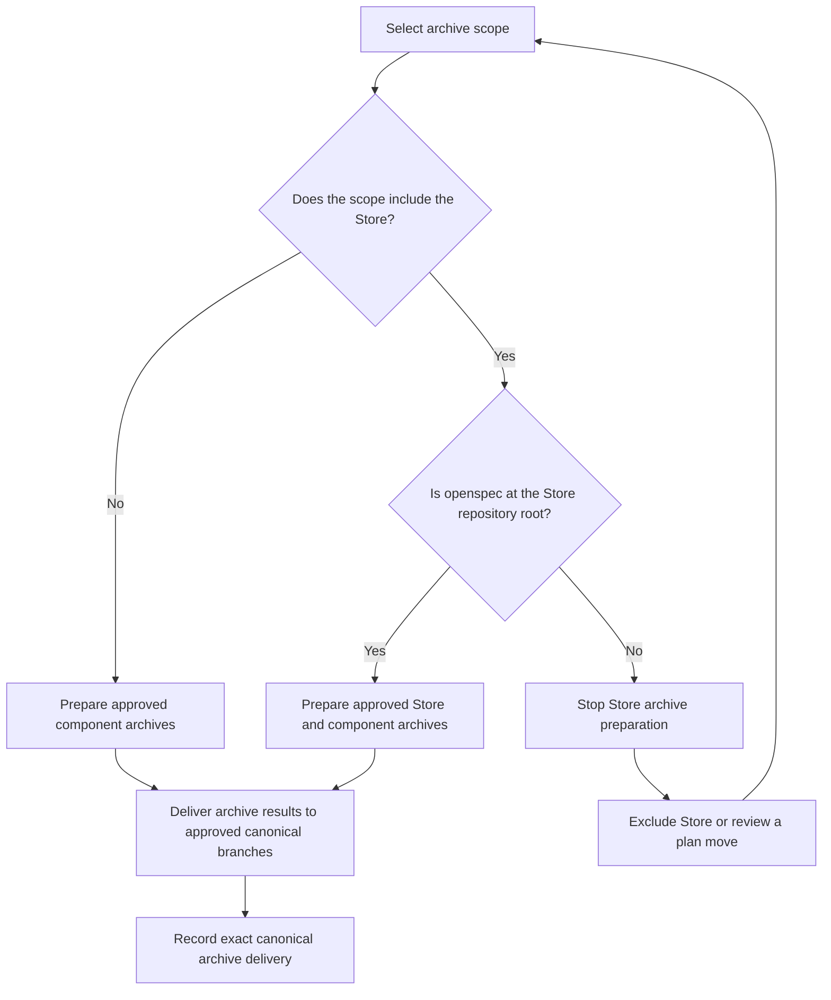
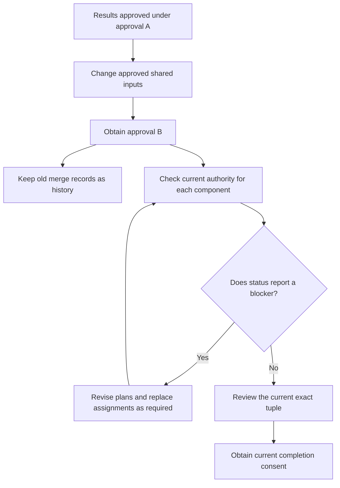
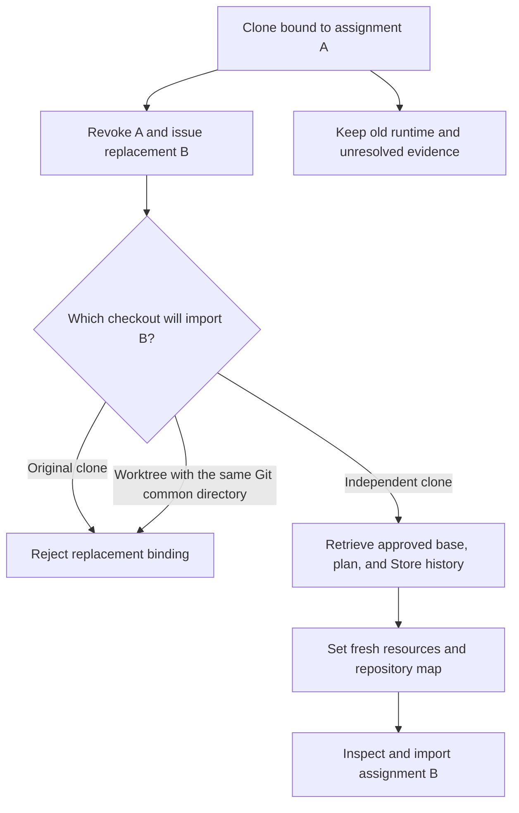
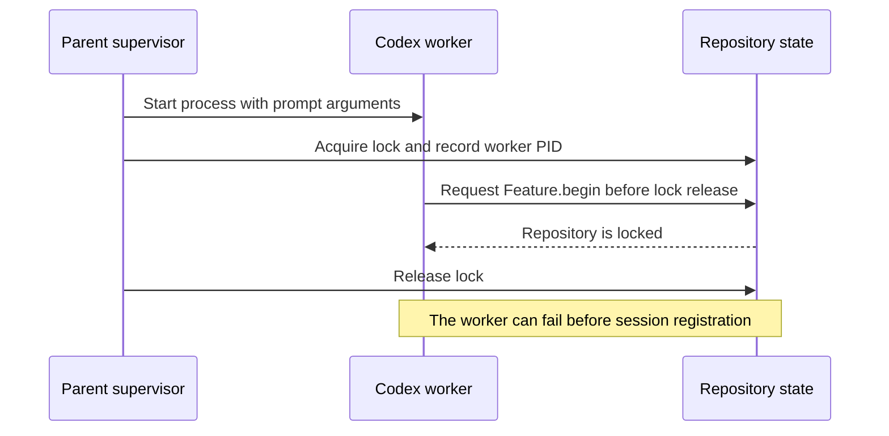
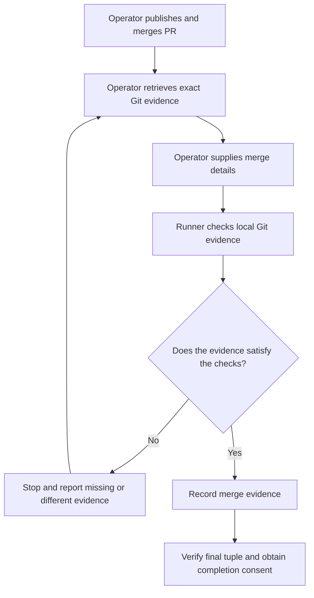

# Documented limits

This document explains the limits of Store-linked component coordination.
The implementation is available in commit `3a86abb`.

The document uses short sentences, active verbs, and direct instructions.
Product names, command names, and code identifiers are technical names.
The text follows ASD-STE100 writing principles. Formal STE compliance has not been verified.

## Terms

| Term | Meaning |
|---|---|
| Store | The Git repository that contains the shared plan and coordination records. |
| Component | One part of a shared feature, such as API or Web. |
| Assignment | The approved work for one component and one owner. |
| Binding | The local record that connects a change to its imported assignment. |
| Independent clone | A Git clone with its own Git common directory and runner state. |
| Worktree | A checkout that shares a Git common directory with another checkout. |
| Approval | User consent for an exact plan, context, settings, and checks. |
| Tuple | The exact set of component commits used for shared verification. |
| Canonical branch | The approved branch that receives the final archive result. |
| PR | A pull request in a Git hosting service. |

## 1. Store archive location

**Type: Current implementation limit.**

### Supported location

The runner can prepare the shared Store archive at this location:

```text
store-repository/
  openspec/
    changes/
      <shared-change>/
```

The `openspec` directory must be at the Store repository root.
The runner rejects Store archive preparation for a nested planning root.

This example is outside the supported Store archive layout:

```text
store-repository/
  planning/
    openspec/
      changes/
        <shared-change>/
```

### Effect

You can coordinate and complete the feature with a nested Store planning root.
The runner cannot automatically prepare the Store archive for that layout.
Feature completion and archive delivery are separate states.
Archive preparation alone does not set the archive state to `archived`.

### Procedure

Use one of these options:

1. Approve a component-only archive scope with `includeStore: false`.
   This scope excludes the Store archive.
2. Move the Store planning files to the supported location through a reviewed change.
   Obtain new approval before you continue.
3. Extend the implementation to support the required Store archive location.
   Review and test that extension before use.



See [Post-merge archival](team-workflow.md#post-merge-archival).

## 2. Approval renewal applies to the whole feature

**Type: Version 1 authority rule with a conservative scope.**

### Rule

An approval connects user consent to exact shared inputs.
These inputs include the contract, component plans, settings, and required checks.

A new approval starts a new feature-wide approval period.
The implementation calls this period an approval epoch.
Results from the old approval do not automatically become current milestones under the new approval.
This rule also applies when some component code did not change.

### Example

1. Accept and merge API and Web under approval A.
2. Change shared guidance.
3. Obtain approval B for the new shared inputs.
4. Inspect the current status of API and Web.

The runner keeps the old merge records.
It can mark an old result as `requiresReapproval`.
That result cannot authorize a new dependent assignment or current completion.

### Effect

The runner does not remove commits or undo merges.
The old records remain available as history.
Their existence does not prove compliance with the new approval.

Old combined reviews, final reviews, and completion consent do not automatically carry forward.
Version 1 has no automatic procedure to transfer unchanged component authority to a new approval.
This rule can require additional planning and coordination work.

### Procedure

1. Inspect every component blocker with `coordination status --json` and the required feature, Store, and map arguments.
2. Check the current shared inputs and component plans.
3. Resolve the reported plan and assignment conflicts.
4. Use a revised component plan and renewed approval for further work on a merged component.
5. Revoke and replace stale assignments when required.
6. Review the current exact tuple.
7. Obtain new completion consent when required.

Do not assume that every component must repeat all work.
Use the reported blockers to determine the required actions.



See [Changes, failures, and recovery](team-workflow.md#changes-failures-and-recovery).

## 3. Replacement assignments need independent clones

**Type: Current local binding and recovery limit.**

### Rule

An implementation clone retains its imported assignment for the bound change.
A coordinator revocation does not replace that local binding.
The clone rejects a different assignment identity for the same bound change.

A new worktree does not solve this problem.
Worktrees share the Git common directory.
The binding and runner state are in that directory.

### Effect

Use a fresh independent clone for a replacement assignment.
The replacement clone can be on the same machine.
It must have its own Git common directory and runner state.

Version 1 has no supported operation to retire and replace the binding in the same clone.
Do not delete the binding to force a replacement.
That action can disconnect outstanding jobs from their state and evidence.

### Procedure

1. Keep the old clone, runtime, worktrees, and logs while jobs or evidence remain unresolved.
2. Revoke the old assignment with an explicit reason.
3. Create a replacement assignment under current approval.
4. Create a fresh independent implementation clone.
5. Retrieve the exact approved base, committed plan, and required Store history.
6. Check out the approved base and verify the repository identity.
7. Create fresh local resources and a repository map for the new clone.
8. Run the normal component inspect and import procedure.
9. Check component status with the replacement assignment and owner.



See [Changes, failures, and recovery](team-workflow.md#changes-failures-and-recovery).

## 4. Real Codex worker startup has a known timing risk

**Type: Known pre-existing production risk. This risk remains unresolved.**

### Cause

The supervisor starts a worker process.
The parent then records the worker PID while it holds the repository lock.
A fast child can request `Feature.begin` before the parent releases that lock.
The request can fail with `Repository is locked`.
The worker can fail before it registers its session.

Codex receives its prompt through command-line arguments.
It can start processing before parent registration finishes.
The real Claude stdin dispatch occurs after registration.



### Test correction

The fake test workers now wait for two conditions:

- The saved worker PID equals the fake worker PID.
- The repository lock is absent.

The wait has a ten-second limit.
After that limit, the fake worker fails with an explicit timeout.
This correction makes the review and export tests reliable.
It preserves the rules that reject unsuccessful worker evidence.

### Remaining effect

The correction changes the test fixture.
It does not change real Codex startup ordering.
The 204 passing tests do not prove that this production timing risk is absent.
The frequency of this problem with real Codex workers has not been measured.

If this failure occurs, inspect the job status and logs before recovery.
Do not accept incomplete evidence or remove the repository lock to force progress.

A future production fix must establish worker readiness before the child can request a state change.
It must preserve the lock and successful-exit checks.

## 5. Operators control Git synchronization and PR publication

**Type: Intentional design boundary.**

### Rule

The runner checks locally available Git evidence.
The operator states that the PR merged and supplies its URL and exact delivery commit.
The runner does not query a hosting service for live PR status.
A PR URL alone is insufficient merge evidence.

The runner does not automatically clone, fetch, pull, push, or publish branches.
Operators perform these actions through their normal Git workflow.

### Checks

The runner checks delivery commit reachability on the declared, locally available delivery branch.
For a normal merge, it also checks accepted commit ancestry.
For squash or rebase delivery, the operator must specify the actual merge style.
The runner compares the accepted changed-path content with the delivery commit.

A content difference requires fresh delivered-snapshot review and independent acceptance.
Changes outside the accepted paths can remain different.
Final verification uses the recorded merged tuple.

### Effect

Local status describes the retrieved Git state.
It does not prove the current state of the hosting service.
Missing or old local history can prevent the runner from finding required evidence.

### Procedure

1. Publish and merge the PR through the authorized Git workflow.
2. Retrieve the exact delivery commit and update the declared local delivery branch.
3. Inspect local differences before branch updates.
4. Supply the actual merge style, PR URL, and operator statement.
5. Preview and record the verified merge evidence.
6. Run current final verification and obtain completion consent.

If a coordination push is rejected, inspect remote history and resolve the conflict.
Do not force-push coordination history as a recovery shortcut.
A preview token does not authorize publication.



See [Lifecycle, delivery, and archival](superpowers/specs/2026-10-04-store-linked-components-design.md#8-lifecycle-delivery-and-archival).

## Verification scope

The implementation passed 204 tests and the package dry run.
The final review approved the implementation within the limits in this document.
These results do not extend support to excluded configurations.
They do not resolve the real Codex startup timing risk.

See the [completion checkpoint](superpowers/plans/2026-10-04-store-linked-components-checkpoint.md) for verification records and recovery references.
