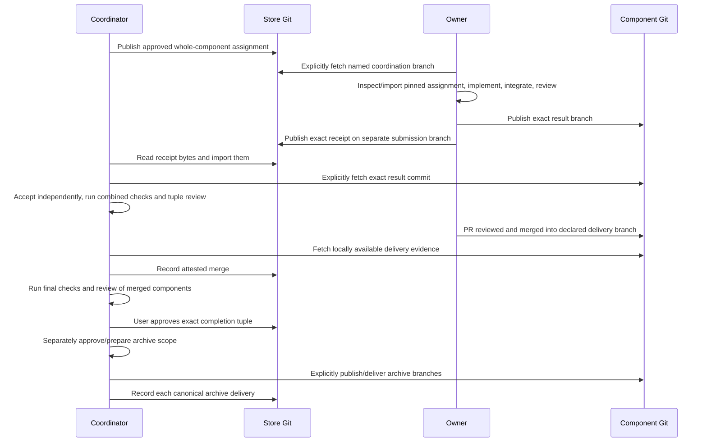
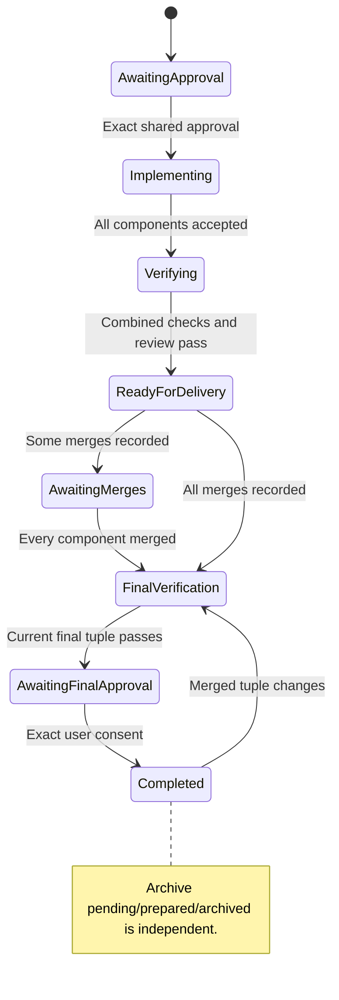

# Team workflow: operator reference

This reference is for agents and operators who run the CLI directly.
It contains command sequences, input schemas, and detailed recovery procedures.
Start with the [team workflow guide](team-workflow.md) for roles, steps, and process diagrams.

The Bash functions below are local shortcuts. For example, `coord accept` calls
`openspec-runner coordination accept`; `coord` is not an installed command.

The `coordination` and `component` commands implement shared features across Git
repositories and independent machines. One coordinator maintains immutable Store
records. Each owner imports a whole component assignment, runs the existing local
runner, reviews its result, and exports a portable receipt. Existing local managed
features and unmanaged batches retain their own lifecycle; see the [user guide](user-guide.md).

## Roles and ownership

The coordinator issues/revokes assignments, imports owner receipts, independently
accepts submitted results, records merge evidence, reviews component tuples,
records user-approved completion, and coordinates archival. Owners execute frozen
assignments and publish result branches and receipt bytes. PR reviewers use the
team's ordinary Git review process. Owner labels document responsibility; Git
access/review controls publication. The runner does not authenticate a label or
query a hosting provider's live PR state.

A Store selector selects planning context; it never discovers implementation
repositories. `--store` is the explicit **Store Git checkout path**, whereas
`manifest.storeId` is the OpenSpec Store selector. `--map` is a local JSON object
mapping repository identities to machine checkout paths. Paths never enter portable
approval, assignment, receipt or event records. Each component keeps a local
OpenSpec change. Registered upstream Stores are read-only references; they are
not task ownership or workset routing.

## Team interaction



## Prepare the repositories and machines

Use Linux, macOS or WSL, Node.js 22.13+, Git, the runner, and the approved authenticated
harness. Initialize each component with `openspec-runner init --agent codex` (or
`claude`/`all`). Init installs six skills, including `openspec-runner-component`.
Commit the generated skills/config and all planning inputs before shared approval.

Use an installed OpenSpec build with the required Stores JSON capabilities. Configure
its Store registration and component references according to the [OpenSpec Stores guide](https://github.com/Fission-AI/OpenSpec/blob/main/docs/stores-beta/user-guide.md).
The runner invokes `openspec status --change CHANGE --store STORE_ID --json` and
`doctor --json` (or `context --json`) through its adapter. Status must report
`root.path/source/store_id`, `changeRoot`, and artifact output/existing paths;
references must report Store IDs and roots. The resolved planning root must equal
the explicit `--store` checkout. Capability errors identify the missing fields and
inspection commands; upgrade OpenSpec or repair local registration. No project-specific
behavior is inferred from upstream documentation.

Set stable repository identities in every relevant clone, including independent
owner/coordinator clones:

```sh
git -C "$STORE" config openspec-runner.repository contracts
git -C "$API" config openspec-runner.repository api
```

Prepare shared `checkout-promo` and local `implement-checkout-promo-api` OpenSpec
changes. This complete example has one API component; add Web or other components
with their own settings, dependencies and task mapping when needed. Its shared
`tasks.md` contains `- [ ] 1.1 Deliver API`; its API `tasks.md` contains the
numbered implementation tasks and a committed `execution.yaml` covering every ID.
For this example task `1.1` is sufficient. The approved implementation harness is
Codex, with an explicitly discovered model and supported `high` effort.

## Complete input schemas

[The checked input builder](examples/linked-feature-inputs.mjs) writes complete
manifest, settings, map, resource-overlay and archive-scope files. It takes
explicit paths, model and branch names; it never invents SHAs or tokens. Run
`openspec-runner models --agent codex --json` and `planning-rules --agent codex --json`
to select an available model supporting the specified effort. Set these operator
variables to the intended values before following the examples:

```sh
STORE=/work/team-contracts
API=/work/checkout-api
INPUT=/tmp/checkout-promo-inputs
FEATURE=checkout-promo
COORDINATION_BRANCH=team/checkout-promo
DELIVERY_BRANCH=release/checkout
# MODEL is the model you selected from harness discovery, with high effort supported.
: "${MODEL:?Set MODEL to the selected supported Codex model}"

node /path/to/openspec-runner/docs/examples/linked-feature-inputs.mjs \
  --store "$STORE" --api "$API" --model "$MODEL" \
  --coordination-branch "$COORDINATION_BRANCH" --delivery-branch "$DELIVERY_BRANCH" \
  --out "$INPUT"
```

The builder emits this entire version-1 manifest. The model value is substituted
from the operator's discovery choice, and the branch values come from the explicit
arguments above. `tasks: {}` requests resolution for every committed task from the
implementation default and execution metadata; the approval/assignment snapshot
contains the full resolved per-task map.

```js
{
  version: 1,
  featureId: "checkout-promo",
  storeId: "team",
  sharedChange: "checkout-promo",
  coordinationBranch: COORDINATION_BRANCH,
  components: {
    api: {
      repository: "api",
      change: "implement-checkout-promo-api",
      deliveryBranch: DELIVERY_BRANCH,
      dependencies: [],
      settings: {
        implementation: { harness: "codex", model: MODEL, effort: "high" },
        tasks: {},
        review: { harness: "codex", model: MODEL, effort: "high" },
        repair: { harness: "codex", model: MODEL, effort: "high" },
        maxFixRounds: 2,
        setup: [],
        verifyIntegration: []
      }
    }
  },
  taskMapping: { "1.1": [{ type: "merged", componentId: "api" }] },
  verification: [],
  completion: { requireAllMerged: true }
}
```

`settings.json` is exactly the settings object above, not a separate coordination
approval input. All setup/check arrays must match committed component
`openspec/runner.yaml` settings. The minimal example uses empty arrays; for real
verification configure approved argv arrays such as `verifyIntegration:
[["node", "--test"]]` in both places. Manifest tuple checks have shape
`{ componentId: "api", command: ["node", "--test"] }`. Every check runs in its
named component's exact verification checkout. Setup precedes checks; argv arrays
are not shell strings.

The generated map is `{ "contracts": STORE, "api": API }`, with absolute resolved
paths. An independent machine writes its own map. Relative map paths resolve from
the map file directory. The resources file is
`{ worktrees: "git", terminal: "manual", worktreeRoot: API + "/.openspec-runner/worktrees" }`.
Only these resource keys are permitted; local overlays cannot change task scope,
models, setup or checks. The archive scope is
`{ componentIds: ["api"], includeStore: true, storeDeliveryBranch: COORDINATION_BRANCH }`.
Store inclusion requires the explicitly chosen canonical Store branch; it need
not equal the coordination branch. No default main/master branch is assumed.

Optional `--references FILE` on init/approve/assign takes the existing API's
`ReferenceInput[]`. A canonical-only reference is complete as
`[{ repository: "upstream", root: "/work/upstream", storeId: "upstream-store" }]`;
add that identity/root to the local map. Optional `revision` pins a locally
available commit; `relevantPaths` narrows its portable selected paths. An active
reference uses `{ repository, context: ResolvedContext, revision?, relevantPaths? }`;
resolve its context through the same OpenSpec JSON adapter. Every registered
reference must have an explicit pinned input/map entry. Nested references need an
explicit flattened inventory. Portable records retain content, selections,
revision and fingerprint, never those machine roots.

## Complete team walkthrough

The shell examples use Bash. All output files below are external operator files. `field` reads authentic values
from a CLI response; tokens and full SHA values are never guessed. Use a clean
Store checkout on the manifest's named coordination branch. Create/select that
branch explicitly with Git and ensure the declared delivery branch exists in the
coordinator's component clone. Commit intended shared/component planning inputs
before init and approval.

```sh
field() {
  node -e 'let v=JSON.parse(require("node:fs").readFileSync(process.argv[1],"utf8")); for(const k of process.argv[2].split(".")) v=v[k]; if(typeof v!=="string") throw Error("Expected string field"); process.stdout.write(v)' "$1" "$2"
}
coord() { openspec-runner coordination "$1" "$FEATURE" --store "$STORE" --map "$INPUT/map.json" "${@:2}"; }

coord init --file "$INPUT/manifest.json" --dry-run --json > "$INPUT/init-preview.json"
coord init --file "$INPUT/manifest.json" --operation init-promo-v1 \
  --expected-head "$(field "$INPUT/init-preview.json" head)" --json
coord approve --dry-run --json > "$INPUT/approval-preview.json"
```

Present that exact approval snapshot to the user: shared contract revision/content,
component bases/plans, resolved task/review/repair settings, checks, dependencies,
and repair limits. After actual user consent, record it:

```sh
coord approve --id approval-promo-v1 --operation approve-promo-v1 \
  --expected-head "$(field "$INPUT/approval-preview.json" head)" \
  --confirm "$(field "$INPUT/approval-preview.json" token)" --approved-by user --json
coord assign --component api --owner alice --dry-run --json > "$INPUT/assignment-preview.json"
coord assign --component api --owner alice --id assignment-alice-v1 --operation assign-alice-v1 \
  --expected-head "$(field "$INPUT/assignment-preview.json" head)" \
  --confirm "$(field "$INPUT/assignment-preview.json" token)" --json
coord inspect --kind assignment --record assignment-alice-v1 --json > "$INPUT/assignment.json"
```

An assignment contains its immutable record identity, `approvalId`, `componentId`,
`owner`, repository/change, full `base` SHA, `planFingerprint`, complete resolved
settings, pinned contract and exact dependency commits. Inspect its actual JSON;
copying a digest alone is not shared approval. Publish the declared coordination
branch explicitly, as described below.

On Alice's machine, `STORE` and `API` point to her independent clones with the same
repository identities. Retrieve the named coordination history and component base
using authorized Git handoffs. Run inside `API` (or pass `--root "$API"`):

```sh
component() { openspec-runner component "$1" "$FEATURE" --store "$STORE" --root "$API" --repository api "${@:2}"; }
component inspect --assignment assignment-alice-v1 --owner alice --json > "$INPUT/import-preview.json"
component import --assignment assignment-alice-v1 --owner alice --dry-run --json
component import --assignment assignment-alice-v1 --owner alice \
  --expected-head "$(field "$INPUT/import-preview.json" historyRevision)" \
  --confirm "$(field "$INPUT/import-preview.json" token)" --json
component status --change implement-checkout-promo-api --json
```

Pass `--file resources.json` consistently to inspect/import when using a local
overlay. Inspection checks harness capabilities without launching workers or writing
runtime resources. Import uses the exact inspected Store revision as expected head
and materializes immutable context. A newer registered Store checkout does not
replace the assignment's pinned context. Importing again resumes the same binding;
changed assignment/owner/settings identities are rejected. For a replacement
assignment for the same bound change, use the fresh independent clone procedure
in [Changes, failures, and recovery](#changes-failures-and-recovery).

Use `$openspec-runner-component` or `/openspec-runner-component` for task execution.
Run local `status`, then preview/launch ready task batches without model/harness/base
overrides; `integrate` only exited, verified worker results. After every task is
integrated, run a fresh `feature review implement-checkout-promo-api`. Repair any
blocking findings with `feature fix`, integrate that repair, then review again within
the assigned limit. Manual-terminal mode returns supervised worker commands to run
once; inspect reports and exit receipts rather than assuming a quiet pane finished.
Do not use local final approval or archival for an imported component.

```sh
component export --change implement-checkout-promo-api --outcome completed --dry-run --json > "$INPUT/export-preview.json"
component export --change implement-checkout-promo-api --outcome completed \
  --id receipt-alice-v1 --operation export-alice-v1 --output "$INPUT/receipt.json" \
  --expected-head "$(field "$INPUT/import-preview.json" historyRevision)" \
  --confirm "$(field "$INPUT/export-preview.json" token)" --json > "$INPUT/export.json"
```

Export runs approved verification at the exact clean reviewed result. The complete
receipt schema below uses fields read from the actual assignment/export, rather
than invented literal SHAs or tokens. `createdAt` is generated once and preserved
by retries; optional `--created-at` may supply an ISO timestamp at first export.

```js
{
  version: 1, kind: "submission", featureId: FEATURE,
  id: "receipt-alice-v1", operationId: "export-alice-v1", createdAt: actualTimestamp,
  assignmentId: "assignment-alice-v1", owner: "alice", repository: "api",
  change: "implement-checkout-promo-api", outcome: "completed",
  base: assignment.base,
  planFingerprint: assignment.planFingerprint,
  contractFingerprint: assignment.contract.fingerprint,
  result: { branch: exportedBranch, commit: exportedFullSHA },
  tasks: [{ id: "1.1", completed: true }],
  review: { commit: exportedFullSHA, findings: [] },
  verification: [{ command: ["node", "--test"], exitCode: 0, evidence: actualCheckOutput }]
}
```

That verification entry is present only when configured; the minimal empty-check
example exports `verification: []`. A blocked/failed receipt has the same identity,
assignment, owner, repository/change, base/fingerprints and outcome, a concrete
`reason`, empty `tasks` and `verification`, and no invented `result` or `review`.
Use `--outcome blocked --reason "Missing test credentials"` or the appropriate
failed outcome. Export keeps immutable bytes locally; repeating the exact command
returns them, including when the same output file already has those bytes.
A differing existing output file is never overwritten.

After the owner publishes the result branch and receipt bytes, the coordinator
retrieves the exact result and reads the receipt into an external file:

```sh
coord import --file "$INPUT/receipt.json" --dry-run --json > "$INPUT/import-receipt-preview.json"
coord import --file "$INPUT/receipt.json" --expected-head "$(field "$INPUT/import-receipt-preview.json" head)" --json
coord accept --submission receipt-alice-v1 --dry-run --json > "$INPUT/accept-preview.json"
coord accept --submission receipt-alice-v1 --id accept-alice-v1 --operation accept-alice-v1 \
  --expected-head "$(field "$INPUT/accept-preview.json" head)" \
  --confirm "$(field "$INPUT/accept-preview.json" token)" --json
coord review --stage combined --dry-run --json > "$INPUT/combined-preview.json"
```

Import retains exact receipt bytes and identity, including rejected/stale/failed
claims. Acceptance separately validates active ownership, ancestry, immutable plan
and context, completed tasks, exact component review and coordinator checks. It
needs the owner's commit in the correct local repository, not their runtime directory.

A fresh reviewer must inspect the exact preview tuple. This creates the complete
attestation file from the preview only **after** that review occurred:

```sh
node --input-type=module - "$INPUT/combined-preview.json" "$INPUT/combined-review.json" <<'JS'
import { readFileSync, writeFileSync } from 'node:fs';
const p = JSON.parse(readFileSync(process.argv[2], 'utf8'));
writeFileSync(process.argv[3], JSON.stringify({ tuple: p.tuple, token: p.token,
  reviewedBy: 'reviewer', summary: 'Reviewed the exact component tuple', findings: [] }, null, 2) + '\n');
JS
coord review --stage combined --file "$INPUT/combined-review.json" \
  --id combined-review-v1 --operation combined-review-v1 \
  --expected-head "$(field "$INPUT/combined-preview.json" head)" \
  --confirm "$(field "$INPUT/combined-preview.json" token)" --json
```

`TupleReviewAttestation` requires `tuple`, `token`, `reviewedBy`, nonempty `summary`
and `findings`. Each finding is
`{ id, category, location, impact, correction, componentId, owner }` for tuple
reviews. Categories are `correctness`, `security`, `spec`, `verification`, `style`,
`improvement`; the first four block readiness/completion. Component receipt review
findings may omit component/owner. Record real findings instead of the empty list
when present. Recording a tuple review independently runs the approved tuple checks;
the supplied attestation does not substitute for them.

Accepted and combined-reviewed components are ready for delivery. They are not
shared completion. Have every required PR reviewed and merged into its declared
delivery branch, explicitly fetch that branch, then set `DELIVERY_SHA` to its full
actual delivered commit and `PR_URL` to that PR's actual HTTP(S) URL:

```sh
: "${DELIVERY_SHA:?Set exact locally retrieved delivery SHA}" "${PR_URL:?Set actual merged PR URL}"
coord merge --component api --delivery-commit "$DELIVERY_SHA" --merge-style merge \
  --pr-url "$PR_URL" --attested-by operator --dry-run --json > "$INPUT/merge-preview.json"
coord merge --component api --delivery-commit "$DELIVERY_SHA" --merge-style merge \
  --pr-url "$PR_URL" --attested-by operator --id merge-api-v1 --operation merge-api-v1 \
  --expected-head "$(field "$INPUT/merge-preview.json" head)" \
  --confirm "$(field "$INPUT/merge-preview.json" token)" --json
coord review --stage final --dry-run --json > "$INPUT/final-preview.json"
```

After a fresh final reviewer inspects that exact merged tuple, prepare and record
its actual attestation (use real findings when present):

```sh
node --input-type=module - "$INPUT/final-preview.json" "$INPUT/final-review.json" <<'JS'
import { readFileSync, writeFileSync } from 'node:fs';
const p = JSON.parse(readFileSync(process.argv[2], 'utf8'));
writeFileSync(process.argv[3], JSON.stringify({ tuple: p.tuple, token: p.token,
  reviewedBy: 'reviewer', summary: 'Reviewed the exact merged tuple', findings: [] }, null, 2) + '\n');
JS
coord review --stage final --file "$INPUT/final-review.json" \
  --id final-review-v1 --operation final-review-v1 \
  --expected-head "$(field "$INPUT/final-preview.json" head)" \
  --confirm "$(field "$INPUT/final-preview.json" token)" --json
```

Then preview completion:

```sh
coord complete --dry-run --json > "$INPUT/complete-preview.json"
# Present exact merged tuple and final review, then obtain user consent.
coord complete --id complete-promo-v1 --operation complete-promo-v1 \
  --expected-head "$(field "$INPUT/complete-preview.json" head)" \
  --confirm "$(field "$INPUT/complete-preview.json" token)" --approved-by user --json
coord status --json
```

Completion requires all declared merges, passing current final checks/review and
explicit consent for that tuple/review. Completion leaves archive `pending`.
Optionally include `--file scope.json` in both completion preview/mutation when the
user also approves that exact unchanged archive scope; otherwise consent separately.

## Git handoff examples

The runner never fetches or pushes. Execute these Git commands only within the
operator's authorized publication/retrieval scope. All branches are explicit.
The [Git fetch refspec documentation](https://git-scm.com/docs/git-fetch) and
[Git push documentation](https://git-scm.com/docs/git-push) explain these ref updates.

Coordinator publication and owner retrieval:

```sh
git -C "$STORE" push origin "$COORDINATION_BRANCH:refs/heads/$COORDINATION_BRANCH"
git -C "$STORE" fetch origin "refs/heads/$COORDINATION_BRANCH:refs/remotes/origin/$COORDINATION_BRANCH"
git -C "$STORE" switch "$COORDINATION_BRANCH"
git -C "$STORE" merge --ff-only "origin/$COORDINATION_BRANCH"
```

Owner publication in the component clone uses the branch returned by export:

```sh
RESULT_BRANCH=$(field "$INPUT/export.json" record.result.branch)
git -C "$API" push origin "$RESULT_BRANCH:refs/heads/$RESULT_BRANCH"
```

Create the owner Store submission branch from the retrieved coordination history.
Only copy the receipt; owners do not write authoritative coordinator records:

```sh
HANDOFF_BRANCH=submissions/alice/checkout-promo-v1
git -C "$STORE" switch -c "$HANDOFF_BRANCH" "origin/$COORDINATION_BRANCH"
mkdir -p "$STORE/runner/features/$FEATURE/submissions"
cp "$INPUT/receipt.json" "$STORE/runner/features/$FEATURE/submissions/receipt-alice-v1.json"
git -C "$STORE" add "runner/features/$FEATURE/submissions/receipt-alice-v1.json"
git -C "$STORE" commit -m "Submit Alice component receipt"
git -C "$STORE" push origin "$HANDOFF_BRANCH:refs/heads/$HANDOFF_BRANCH"
```

In the coordinator clone, fetch/read the receipt without merging the owner's branch
into authority or switching away from the coordination branch:

```sh
git -C "$STORE" fetch origin "refs/heads/$HANDOFF_BRANCH:refs/remotes/origin/$HANDOFF_BRANCH"
git -C "$STORE" show "origin/$HANDOFF_BRANCH:runner/features/$FEATURE/submissions/receipt-alice-v1.json" > "$INPUT/receipt.json"
git -C "$API" fetch origin "refs/heads/$RESULT_BRANCH:refs/remotes/origin/$RESULT_BRANCH"
# Confirm the full returned result SHA exists in this repository before acceptance.
git -C "$API" cat-file -e "$(field "$INPUT/export.json" record.result.commit)^{commit}"
```

For merge/archive evidence, the manifest delivery branch must be a locally available
`refs/heads/...` branch, not just a remote-tracking name. Fetch it explicitly and
fast-forward its local branch with ordinary Git, inspecting local differences first.
A rejected authoritative push requires inspecting remote history and reconciling
immutable operations/ownership before continuing; never force-push coordination
history or recreate records with different payloads under old IDs.

## Post-merge archival

Preview separate scope, show the exact post-merge bases and allowed OpenSpec paths,
and obtain archive consent. Store archival currently supports only
`openspec/changes/<shared-change>` at the Store repository root. Nested Store planning
roots require a component-only scope (`includeStore: false`) or a reviewed plan move
and renewed approval; diagnostics state this limitation. OpenSpec canonical spec
updates are included in the approved allowed namespaces and verified after preparation.

```sh
coord archive-approve --file "$INPUT/scope.json" --dry-run --json > "$INPUT/archive-preview.json"
coord archive-approve --file "$INPUT/scope.json" --approved-by user \
  --id archive-approval-v1 --operation archive-approval-v1 \
  --expected-head "$(field "$INPUT/archive-preview.json" head)" \
  --confirm "$(field "$INPUT/archive-preview.json" token)" --json
coord archive-prepare --file "$INPUT/scope.json" --dry-run --json > "$INPUT/archive-prepare-preview.json"
coord archive-prepare --file "$INPUT/scope.json" --id archive-promo-v1 --operation archive-promo-v1 \
  --expected-head "$(field "$INPUT/archive-prepare-preview.json" head)" \
  --confirm "$(field "$INPUT/archive-prepare-preview.json" token)" --json > "$INPUT/archive-prepared.json"
coord archive-inspect --operation archive-promo-v1 --json > "$INPUT/archive-receipt.json"
```

Preparation invokes OpenSpec once per approved target in retained coordinator-owned
post-merge checkouts. It writes `runner-archive/<feature>/<operation>/<target>` local
branches and portable prepared records; `_store` identifies the Store target.
Inspect the receipt's target path/branch/commit and preview's canonical target branch.
Publish each prepared branch explicitly, review/deliver it through the target's
normal Git process, then retrieve its full canonical delivery SHA. Preparation is
not canonical delivery. Inspect each prepared event using `coord inspect --kind event
--record EVENT_ID`; IDs are returned in `archive-prepared.json` Store-relative paths.

For each prepared event, after canonical delivery:

```sh
: "${PREPARED_EVENT:?Set returned prepared event ID}" "${ARCHIVE_DELIVERY_SHA:?Set actual canonical archive SHA}"
coord archive-deliver --prepared "$PREPARED_EVENT" --delivery-commit "$ARCHIVE_DELIVERY_SHA" \
  --dry-run --json > "$INPUT/archive-delivery-preview.json"
coord archive-deliver --prepared "$PREPARED_EVENT" --delivery-commit "$ARCHIVE_DELIVERY_SHA" \
  --id "delivered-$PREPARED_EVENT" --operation "delivered-$PREPARED_EVENT" \
  --expected-head "$(field "$INPUT/archive-delivery-preview.json" head)" \
  --confirm "$(field "$INPUT/archive-delivery-preview.json" token)" --json
```

Every approved target needs a canonical record with matching changed-path blobs,
modes/deletions and active-change removal. Until all are delivered, status remains
`prepared`; afterward it is `archived`. Delivery completion remains a separate fact.

## Dependencies and parallel work

Each component's `dependencies` is an array of
`{ componentId: "api", milestone: "accepted" }` or `"merged"`. IDs must exist and
the graph must be acyclic. These milestones gate **issuing** a whole-component
assignment. Assignments retain exact upstream commits. No dependency permits
independent assignments; dependencies selected concurrently are not automatically
satisfied. Changing an accepted upstream commit invalidates unmerged dependents and
tuple review. Historical merges remain facts; further implementation of a merged
component needs revised component planning and renewed shared approval.

`taskMapping` maps every unfinished shared task to a nonempty list of
`{ type: "merged", componentId: ID }` or `{ type: "final-verification" }` milestones.
Only recorded merges/current passing final review update shared task checkboxes,
atomically with their event. Assignment, owner completion, acceptance and combined
review leave shared milestones incomplete. Stale/failed final verification clears
its mapped final milestone.

## Status and completion



Both text output and `--json` render the same facts. Linked responses include
`version: 1`, `command`, `action`, `featureId`, `dryRun`, `planningRoot` and
`implementationRoot` (component) or `implementationRoots` keyed by component.
Status includes actual `acceptance` and `delivery` fields from committed replay:
coordinator fields are keyed by component; component fields describe that assignment's
component. Acceptance contains `phase` and nullable accepted `commit`; delivery
contains declared `branch` and nullable merged `commit`. `archive`, nullable
`blocker`, and `nextAction` are explicit. Coordinator status also includes `phase`,
`head`, `approvalId` when present, `components`, receipt dispositions and
`pendingOperations`. Component status exposes pinned context paths, local binding,
`inspectedHistory` and revocation relative to that available revision. Previews/actions
without replayed lifecycle facts use null acceptance/delivery/archive values;
these are not claims about remote PR state.

Status can reconstruct from committed Store history in a new offline clone with a
local machine map, without old coordinator runtime. `--revision SHA` inspects
available historical coordination history, not remote freshness. Current status
checks relevant approved context drift; unrelated coordination commits do not
invalidate approval. Approved canonical Store archive transformations preserve
completed state while unauthorized relevant guidance/context drift requires approval.

## Changes, failures, and recovery

| Trigger | Action |
|---|---|
| Local import interrupted/reserved | Inspect its binding and resume `component import` with the original assignment/token/history/resources. Do not delete state or use a new identity to hide uncertainty. |
| Owner changes/assignment revoked | `coord revoke --assignment ID --reason TEXT --dry-run --json`, then real revoke with record/operation IDs and expected head. Assign a new identity under current approval; import the replacement in a fresh independent clone as described below. A locally finished old result may be rejected. |
| Approved scope/settings/context changes | Commit revised artifacts, preview/approve exact shared snapshot, inspect feature-wide blockers and reconcile plans/assignments. Revoke/reassign stale assignments, then import replacements in fresh independent clones. Do not locally reapprove imported settings or substitute newer mutable Store context. |
| Blocked/failed owner | Export concrete blocked/failed receipt. Keep result/session recovery local; coordinator imports the claim and reports blocker/next action. |
| Receipt publication fails | Retain exact export bytes/result branch and retry the explicit Git publication. Do not regenerate a different timestamp/payload under the same receipt ID. |
| Coordinator publication rejected | Fetch/inspect remote authority, reconcile branch history/ownership and immutable IDs. No force push. A preview token never authorizes publication. |
| Interrupted acceptance/review/delivery acceptance | Inspect saved local verification journal and worktrees. Retry the exact original command/identity only after resolving ambiguity. Known failed/running checks cannot be blindly rerun with a new operation ID. Shared status retains pending operations. |
| Combined/final blocking findings | Return findings to owners; repair only within approved limits. New scope or exhausted limits require user direction and reapproval. |
| Squash/rebase rewrites accepted content | Use actual `--merge-style`; inspect merge `mismatches`. Preview `accept-delivery` with the same merge inputs, supply `{ commit: DELIVERY_SHA, reviewedBy, summary, findings }` for a fresh exact-commit review, then record independent checks with token/head/IDs before merge. Ordinary submission acceptance still requires assigned-base ancestry. |
| New merge/current final review invalidates completion | Run fresh final tuple review and obtain new exact completion consent. Old merge history is retained. |
| Archive command fails or loses supervisor | `archive-inspect --operation ID`. Inspect the retained target checkout/diagnostics. `archive-recover --operation ID --target ID --attested-by LABEL --dry-run` only shows the receipt; real recovery additionally requires current expected head and validates exact scope/output before adopting it. Retry original `archive-prepare` IDs/token/head; OpenSpec is not rerun. Unexpected output remains rejected. |
| Archive prepared but not canonically delivered | Publish/deliver explicit prepared branches, retrieve canonical evidence, and record `archive-deliver` per target. Never declare `archived` from preparation alone. |

For explicit reassignment, first retain the old assignment record and reason:

```sh
coord revoke --assignment assignment-alice-v1 --reason "Owner changed" --dry-run --json > "$INPUT/revoke-preview.json"
coord revoke --assignment assignment-alice-v1 --reason "Owner changed" \
  --id revoke-alice-v1 --operation revoke-alice-v1 \
  --expected-head "$(field "$INPUT/revoke-preview.json" head)" --json
# Inspect current approval and assign a new ID; never edit the old assignment.
```

An implementation clone already bound to this change keeps its original assignment.
For the replacement, create a fresh **independent clone** of the implementation
repository, retrieve the replacement assignment's exact approved base and committed
plan plus the Store's authoritative coordination history through the authorized Git
handoff, and check out that base. Verify the repository identity. Create fresh local
resources and a machine repository map for the new clone; update the Store/implementation
paths used by the handoff commands. Run the normal `component inspect`, preview/import
and `component status` sequence with the replacement ID, owner, resource file and exact
inspected history revision. A new worktree sharing the old clone's Git common directory
is insufficient: the binding and runtime live in that common directory. Retain the old
clone, runtime, worktrees and logs while any jobs, verification uncertainty or evidence
remain unresolved. Do not delete its binding to force replacement.

Version 1 approval renewal starts a **feature-wide approval epoch**. Historical merges
remain inspectable, but results under the old approval do not automatically remain live
accepted/merged dependency milestones. Inspect `coord status --json` blockers for every
component, reconcile the approved plans and assignments, and obtain revised plans plus
renewed approval before further implementation of a merged component. Old combined/final
reviews and completion consent do not carry forward; review the current exact tuple and
obtain new consent when required. There is no automatic authority inheritance or local
reset/retirement API for a replacement binding.

For a delivery mismatch, keep all merge inputs identical between preview and
attestation/recording. Set the actual style (`squash` or `rebase`) explicitly:

```sh
MERGE_STYLE=squash
coord accept-delivery --component api --delivery-commit "$DELIVERY_SHA" \
  --merge-style "$MERGE_STYLE" --pr-url "$PR_URL" --attested-by operator \
  --dry-run --json > "$INPUT/delivery-accept-preview.json"
# After fresh review, create delivered-review.json with exact commit, reviewer,
# summary and findings. Its complete schema is { commit, reviewedBy, summary, findings }.
coord accept-delivery --component api --delivery-commit "$DELIVERY_SHA" \
  --merge-style "$MERGE_STYLE" --pr-url "$PR_URL" --attested-by operator \
  --file "$INPUT/delivered-review.json" --id delivery-accept-api-v1 --operation delivery-accept-api-v1 \
  --expected-head "$(field "$INPUT/delivery-accept-preview.json" head)" \
  --confirm "$(field "$INPUT/delivery-accept-preview.json" token)" --json
# Preview/record merge again with the same actual style and delivery evidence.
```

For a failed archive command that already produced valid output, first inspect the
retained target checkout and its exact blobs/paths. The preview is deliberately
read-only and cannot adopt the output:

```sh
coord archive-inspect --operation archive-promo-v1 --json
coord archive-recover --operation archive-promo-v1 --target api --attested-by operator --dry-run --json
coord status --json > "$INPUT/recovery-status.json"
coord archive-recover --operation archive-promo-v1 --target api --attested-by operator \
  --expected-head "$(field "$INPUT/recovery-status.json" head)" --json
# Resume the original preparation exactly, including its original expected head:
coord archive-prepare --file "$INPUT/scope.json" --id archive-promo-v1 --operation archive-promo-v1 \
  --expected-head "$(field "$INPUT/archive-prepare-preview.json" head)" \
  --confirm "$(field "$INPUT/archive-prepare-preview.json" token)" --json
```

All portable mutations require a full `--expected-head` SHA and the manifest's
expected checked-out coordination branch. New records need `--id`/`--operation`
(with optional initial `--created-at`). Init needs only operation identity;
receipt import retains receipt identities. Approval/assignment/acceptance/review/
merge/completion/archive snapshot mutations require `--confirm` from their own
preview. Consent-sensitive approve/complete/archive-approve also require explicit
nonempty `--approved-by`. Repeating original identities/payloads is idempotent;
changed payloads under old IDs are rejected. Recovery of local archive output does
not append portable authority until preparation resumes. Every `--dry-run` is pure:
no records, locks, worker launch, verification execution, context materialization,
checkouts, receipt files, or OpenSpec archival. Already read-only inspect/status
commands reject redundant `--dry-run`. Unknown/repeated/action-inappropriate options
are rejected instead of silently ignored.

## Command reference

Every shared command takes positional feature ID, `--store PATH --map FILE`;
component commands take feature ID, `--store PATH --repository ID` and optional
`--root PATH`. Use `openspec-runner --help` for the exact synopsis.

| Shared action | Action-specific inputs | Preview |
|---|---|---|
| init | `--file MANIFEST --operation ID --expected-head SHA` | yes |
| status | optional `--revision SHA` | read-only |
| inspect | `--kind approval\|assignment\|submission\|event --record ID`, optional revision | read-only |
| approve | consent, optional `--references FILE --contract-revision SHA` | yes |
| assign | `--component ID --owner LABEL`, optional references/contract revision | yes |
| revoke | `--assignment ID --reason TEXT`, identity/head | yes |
| import | `--file RECEIPT --expected-head SHA` | yes |
| accept | `--submission ID`, identity/head/token | yes |
| review | `--stage combined\|final --file ATTESTATION`, identity/head/token | yes; file only needed for mutation |
| merge | component, delivery SHA, merge style, PR URL, operator attestation, identity/head/token | yes |
| accept-delivery | merge inputs plus `--file DELIVERED_REVIEW`, identity/head/token | yes; file only needed for mutation |
| complete | consent, optional `--file ARCHIVE_SCOPE`, identity/head/token | yes |
| archive-approve | `--file ARCHIVE_SCOPE`, consent, identity/head/token | yes |
| archive-prepare | `--file ARCHIVE_SCOPE`, identity/head/token | yes |
| archive-inspect | `--operation ID` | read-only |
| archive-recover | operation, target, operator attestation, current expected head | yes; does not validate/adopt output in preview |
| archive-deliver | `--prepared EVENT --delivery-commit SHA`, identity/head/token | yes |

| Component action | Action-specific inputs | Preview |
|---|---|---|
| inspect | assignment, owner, optional `--file RESOURCES --revision SHA` | read-only |
| import | assignment, owner, optional resource file, expected inspected history SHA/token | yes |
| status | `--change CHANGE`, optional revision | read-only |
| export | change, outcome, optional reason, IDs/operation/output/expected inspected history SHA/token | yes; output only written by mutation |

The complete CLI lifecycle, generated input schema, independent clones, pure
previews, immutable export retries, read-only record inspection, offline replay and
archive inspection/recovery are exercised in `test/coordination-cli.test.mjs`.
