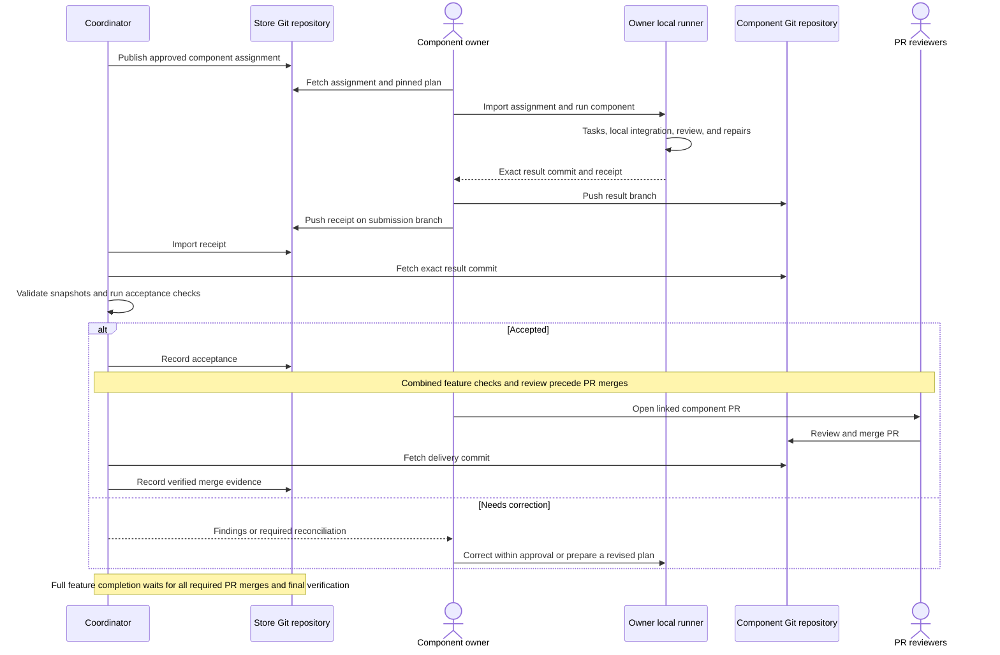

# Shared Store team workflow

**Availability:** this guide describes the proposed openspec-runner team extension.
The `coordination` and `component` command families are design interfaces and are
not implemented in the current CLI. OpenSpec beta setup and ordinary Git commands
below are identified as such. Use the [current user guide](user-guide.md) for
supported runner execution today.

The proposed workflow has one coordinator, a shared contract in an OpenSpec Store,
and a component change in each code repository. Teammates execute entire component
changes on their own machines and exchange assignments and results through Git.

## Contents

- [When to use this workflow](#when-to-use-this-workflow)
- [Roles and ownership](#roles-and-ownership)
- [Team interaction](#team-interaction)
- [Prepare the repositories and machines](#prepare-the-repositories-and-machines)
- [Complete team walkthrough](#complete-team-walkthrough)
- [Git handoff examples](#git-handoff-examples)
- [Dependencies and parallel work](#dependencies-and-parallel-work)
- [Status and completion](#status-and-completion)
- [Changes, failures, and recovery](#changes-failures-and-recovery)
- [Checklists](#checklists)
- [Frequently asked questions](#frequently-asked-questions)

## When to use this workflow

Use it when one feature changes several repositories, when different teams own
the contract and implementation, or when component owners need to work on separate
machines. Each repository keeps its own plan, tests, integration branch, and PR.
The shared feature supplies the common requirements and completion conditions.

The example is a checkout promotion feature:

| Repository | Change | Owner | Responsibility |
|---|---|---|---|
| `team-plans` Store | `checkout-promo` | Coordinator | Promotion contract and shared feature milestones |
| `checkout-api` | `implement-checkout-promo-api` | Alice | Eligibility rules and API response |
| `checkout-web` | `implement-checkout-promo-web` | Bob | Promotion entry and eligibility feedback |

The shared contract defines behavior such as eligible and ineligible promotions,
response fields, and user-visible errors. Component plans describe the repository's
implementation and checks. Both owners can begin independently if the contract
provides what they need; combined testing later uses exact component commits.

## Roles and ownership

| Role | Responsibilities |
|---|---|
| Feature approver | Approve shared behavior, component scope/settings, and the final merged result |
| Coordinator | Link plans, issue assignments, accept submissions, record dependency milestones and merges, verify the full feature, and record completion |
| Component owner | Execute one component, inspect local results, publish the exact result branch and receipt, and address returned findings |
| Local runner and workers | Supervise attempts, verify and integrate tasks locally, perform component review and approved repairs, and export evidence |
| PR reviewers | Review and merge implementation or archive changes through the team's normal Git process |

The coordinator is the sole author of authoritative assignment, acceptance,
revocation, and completion records. Owners submit receipts on separate branches.
Their local runners integrate task results into component branches. The
coordinator's acceptance connects those branches to the shared feature.

## Team interaction



For the complete SDLC and all decision points, see the design's
[feature lifecycle](superpowers/specs/2026-10-04-store-linked-components-design.md#feature-sdlc)
and [detailed workflow diagram](superpowers/specs/2026-10-04-store-linked-components-design.md#full-workflow-with-decision-and-recovery-points).

## Prepare the repositories and machines

### 1. Prepare the Store

Use an OpenSpec build with the documented Stores beta capabilities. Check its
help and follow the [upstream Stores guide](https://github.com/Fission-AI/OpenSpec/blob/main/docs/stores-beta/user-guide.md)
for the installed version. The following are OpenSpec commands, not runner
coordination commands. Repository names and remote URLs are examples to replace
with your team's values.

On the machine creating the Store:

```sh
openspec store setup team-plans --path ~/openspec/team-plans \
  --remote git@github.com:acme/team-plans.git
git -C ~/openspec/team-plans push -u origin main
```

On each other machine:

```sh
git clone git@github.com:acme/team-plans.git ~/openspec/team-plans
openspec store register ~/openspec/team-plans
```

Registration is local to each machine; planning is shared through the Store's
Git repository. Team members may use different checkout locations.

### 2. Keep component plans local

Initialize OpenSpec and the current runner in each code repository. In each
component's `openspec/config.yaml`, declare the shared Store as a reference:

```yaml
schema: spec-driven
references:
  - team-plans
```

This relationship keeps component plans local and exposes upstream specifications
as read-only context. A `store:` pointer instead selects the Store as the planning
root. The chosen team design uses local component plans with references.
[OpenSpec reference behavior](https://github.com/Fission-AI/OpenSpec/blob/main/docs/stores-beta/user-guide.md#story-requirements-that-cross-team-lines)

The coordinator needs local checkouts of every required component for acceptance
and combined verification. Each owner needs their assigned component and the
Store. Install and authenticate the approved worker harness on the owner machine;
configure local tooling using the [current installation guide](user-guide.md#install-and-initialize).

### 3. Prepare the shared and local changes

These are supported OpenSpec operations on a compatible beta build:

```sh
openspec new change checkout-promo --store team-plans
openspec status --change checkout-promo --store team-plans --json
```

Create a component change from inside each code repository:

```sh
openspec new change implement-checkout-promo-api
```

Use `implement-checkout-promo-web` in the web repository. Draft the artifacts
through the installed OpenSpec agent workflows and the runner planning skill.
Review and commit the shared contract and each component plan.

When the shared change is active, read it explicitly:

```sh
openspec show checkout-promo --store team-plans --json
```

OpenSpec reference indexes expose canonical specifications; active shared changes
require explicit retrieval. The proposed assignment workflow adds revision
pinning for reproducible execution.
[Active shared contracts](https://github.com/Fission-AI/OpenSpec/blob/main/docs/stores-beta/user-guide.md#how-does-implementation-start-in-each-repo)

## Complete team walkthrough

The following steps describe proposed runner behavior. They are a user-facing
workflow contract, rather than executable instructions for unreleased commands.

### 1. Link the feature and agree on done

The coordinator prepares a feature manifest linking the shared change to its API
and web changes. It declares repository identities, delivery branches, owners,
component dependencies, execution/review/repair settings, combined checks, and
shared task mappings.

For this example, done requires both implementation PRs merged, the API and web
working together against their recorded delivery commits, a fresh final review
with no blocking findings, and approval of that exact result.

| Shared milestone | Completion evidence |
|---|---|
| API implementation delivered | API PR merge evidence on its declared delivery branch |
| Web implementation delivered | Web PR merge evidence on its declared delivery branch |
| Combined promotion behavior verified | Successful final checks against the recorded merged component commits |

### 2. Approve exact snapshots

The approval preview identifies the Store revision and contract fingerprint,
component base commits and plan fingerprints, effective role settings, checks,
dependencies, and repair limits. The approver reviews those concrete inputs.
The coordinator records consent and publishes the approval through Git.

Assignments retain these inputs even if an owner has different session defaults
or later pulls unrelated Store changes.

### 3. Assign entire components

The coordinator assigns the API change to Alice and the web change to Bob. A
component has at most one active assignment. An assignment contains enough
information to identify the repository, change, owner, approved settings, base,
contract, and any upstream component commits it requires.

The coordinator publishes assignments on the declared coordination branch.
Owners fetch the branch and inspect their assignment. Local checkout paths are
resolved on each machine, rather than encoded in the shared manifest.

### 4. Import and execute locally

The owner checks that the assignment matches their repository and committed
component plan. Import binds local execution to its approved settings and
materializes the pinned contract as read-only context.

The local runner launches ready tasks, observes their reports and successful
exits, and integrates them into the component branch. It then runs a fresh
component review and any approved bounded repairs. Existing local permission
policies remain in effect. Archival waits for delivery of the shared feature.

The owner can continue an active assignment while the coordinator is offline.
Progress becomes shared when the owner publishes a handoff and the coordinator
imports it.

### 5. Export and publish a submission

After local tasks, review, and checks succeed, the owner exports a receipt for
the exact component integration commit. It includes assignment identity,
matching plan/contract fingerprints, task completion, review findings, and
verification evidence.

Publish the component result branch in its code repository. Publish the receipt
on a submission branch in the Store. The component commit must be retrievable
before the coordinator can accept it. A blocked or failed handoff instead
explains what prevented completion.

### 6. Accept the result

The coordinator imports the receipt and retrieves its exact result commit.
Acceptance checks confirm the active assignment, correct repository/base,
unchanged approved planning content, integrated tasks, commit-bound component
review, and successful coordinator-side verification.

Acceptance records a component milestone and may unlock another assignment.
A returned finding can be repaired within the existing approved scope and
budget; changed requirements or settings require revised approval.

### 7. Verify the complete feature

Once all required components are accepted, the coordinator verifies and reviews
their exact commit combination. For checkout promotions, this includes valid
and invalid promotions, eligibility errors, and the frontend's handling of API
responses. A passing component test suite alone does not establish those shared
behaviors.

The successful result is ready for delivery. The owners open component PRs that
link the shared contract revision, local change, assignment, and accepted result.

### 8. Record component merges

After normal PR review and merge, the coordinator fetches the delivery branches
and records a delivery commit and PR URL for each component. Normal merges use
ancestry evidence. Squash or rebase merges identify the delivered commit and
compare affected file content to the accepted result.

Changed delivered content requires fresh component review and acceptance.
Final verification and review use the recorded merged commits. Git evidence
describes fetched state; the operator supplies the PR merge attestation.

### 9. Approve and complete

The final preview names every merged component commit, the corresponding review,
verification results, and remaining advisory findings. With all required PRs
merged and checks passing, the approver consents to that exact tuple. The
coordinator records shared feature completion and completes the mapped Store
milestones.

If a recorded implementation snapshot changes, rerun the affected verification
and review before recording a new final approval.

### 10. Deliver archives

Archival is tracked separately after feature delivery. An approved archive scope
can be included in final approval, so unchanged scope can be used later without
repeating consent. Prepare and verify the component and Store archive commits,
then deliver them through normal review.

An archive branch awaiting merge is pending delivery. The archive is recorded as
delivered only when its result reaches the canonical branch. OpenSpec recommends
post-merge archival for teams; the proposed workflow makes that timing explicit.
[Team archival conventions](https://github.com/Fission-AI/OpenSpec/blob/main/docs/team-workflow.md#when-to-archive)

## Git handoff examples

These are ordinary Git commands. The refs and assignment names illustrate the
checkout example; use the actual refs and IDs reported by the implemented runner.
The proposed runner does not automatically fetch or push branches.

### Fetch coordinator history

In the Store checkout, retrieve the shared coordination branch without switching
the current working checkout:

```sh
git -C ~/openspec/team-plans fetch origin \
  refs/heads/coordination/checkout-promo:refs/remotes/origin/coordination/checkout-promo
git -C ~/openspec/team-plans show --stat origin/coordination/checkout-promo
```

An assignment is an immutable file under
`runner/features/checkout-promo/assignments/`. Inspect the exact file from the
fetched coordination revision and pass that record to the proposed component
import operation.

### Publish a component result

Run the push from the integration worktree reported by the component runner.
Replace `/absolute/path/to/integration-worktree` with that returned path:

```sh
git -C /absolute/path/to/integration-worktree push origin \
  HEAD:refs/heads/components/checkout-promo/api-alice-01
```

Record the exact result SHA in the receipt. The invoking checkout can remain on
its original branch, so its `HEAD` may be different from the implementation.

### Publish the receipt

Use a clean Store checkout and create a submission branch from the fetched
coordination branch:

```sh
git -C ~/openspec/team-plans switch -c submissions/checkout-promo/api-alice-01 \
  origin/coordination/checkout-promo
```

Export the receipt into this branch, stage its exact file, and commit it. Then:

```sh
git -C ~/openspec/team-plans push origin \
  HEAD:refs/heads/submissions/checkout-promo/api-alice-01
```

The coordinator fetches that submission branch, imports the exact receipt, and
publishes the acceptance record on the coordination branch. Publishing a receipt
does not independently accept a result.

### Retrieve the result for acceptance

From the coordinator's API checkout:

```sh
git -C ~/src/checkout-api fetch origin \
  refs/heads/components/checkout-promo/api-alice-01:refs/remotes/origin/components/checkout-promo/api-alice-01
git -C ~/src/checkout-api show --stat origin/components/checkout-promo/api-alice-01
```

Acceptance inspects the receipt's full SHA in a runner-owned verification
checkout. Git's explicit `source:destination` refspec identifies the branch
published or retrieved. [Git fetch](https://git-scm.com/docs/git-fetch),
[Git push](https://git-scm.com/docs/git-push)

## Dependencies and parallel work

| Relationship | Effect |
|---|---|
| No declared component dependency | Owners may implement in parallel against the same approved contract. |
| Depends on an accepted component | Assignment waits for that exact accepted upstream commit. |
| Depends on a merged component | Assignment waits for verified delivery on the upstream's declared branch. |
| Local task dependency | The local runner waits for integration of prerequisite tasks within that component. |

Component dependencies gate assignment and form an acyclic graph. Assignments
pin the upstream commits that satisfied them. An updated accepted upstream result
invalidates affected unmerged downstream acceptance and combined review. Already
merged history remains recorded; further implementation uses reviewed plans.

Each component runner enforces its local concurrency limit. The first version
does not promise a live global worker limit across offline machines.

## Status and completion

| Status | Meaning | Typical next action |
|---|---|---|
| Planned | Component plan is linked, but no active assignment exists. | Approve and assign when dependencies permit. |
| Assigned | An owner may execute the approved component. | Run locally or publish a blocked handoff. |
| Submitted | The owner published a result and receipt. | Coordinator retrieves and checks the result. |
| Accepted | The coordinator accepted an exact result commit. | Unlock dependencies and prepare delivery. |
| Merged | Delivery evidence was recorded for the component PR. | Include the exact delivery commit in final checks. |
| Ready for delivery | All required accepted components passed combined checks and review. | Review and merge component PRs. |
| Shared feature completed | All required component PRs merged and the merged tuple passed final checks, review, and approval. | Deliver approved archives. |
| Archive pending delivery | Archive commits exist on reviewed branches. | Merge the archive PRs. |
| Archive delivered | The archive results are recorded on canonical branches. | Retain history for traceability. |

Blocked, stale, or rejected records retain their reason and required next action.
Status reports the committed coordination revision it reflects. Updates on
another machine appear after explicit Git publication and import.

## Changes, failures, and recovery

| Situation | What to do |
|---|---|
| Store is missing on an owner machine | Clone and register it; verify the assignment's pinned revision is retrievable. |
| Different local checkout paths | Supply local repository mappings. Keep shared identities and records unchanged. |
| Component plan or approved model changed | Prepare and review the revised snapshot before creating a replacement assignment. |
| Unrelated Store files changed | Continue against the pinned relevant inputs; a pull does not rewrite approval. |
| Relevant contract revision is adopted | Reconcile affected assignments and reviews under a new approval. |
| Owner blocked or worker failed | Inspect local evidence and send a concrete blocked/failed handoff; retry only the appropriate local attempt. |
| Coordinator offline | Continue active assignments and publish results for later import. |
| Assignment revoked during offline work | Retain the result for inspection; the coordinator decides whether a new approved assignment can use it. |
| Result branch was not published | Publish the exact receipt commit so acceptance can retrieve it. |
| Acceptance checks failed | Inspect the findings, repair within approved scope/budget, and export a new receipt. |
| Same receipt imported twice | Identical identity and content are idempotent; changed content requires a new submission identity. |
| Coordination push rejected | Fetch and reconcile the competing history before publishing a new decision. |
| Coordinator restarted | Rebuild status from committed records and inspect any pending local transaction. |
| Merge changed accepted content | Obtain fresh review/acceptance of the delivered snapshot and rerun combined checks. |
| Archive interrupted | Inspect the intent and actual output before resuming; keep delivery completion and archive status distinct. |

Use the [current local recovery guide](user-guide.md#resume-recover-and-change-a-plan)
for task, repair, worktree, and process failures on an owner machine.

## Checklists

### Coordinator before assignment

- Shared behavior and component plans are reviewed and committed.
- Repository identities, delivery branches, shared milestone mappings, and checks are clear.
- Role settings and repair limits are resolved and approved.
- Required dependency milestones are available at known commits.
- The assignment is published with one owner and an exact approval snapshot.

### Component owner before submission

- Assignment and local repository/plan match.
- All local tasks are integrated and required checks pass.
- The fresh component review identifies the exact result and has no blockers.
- The result branch is published at the receipt's full commit SHA.
- The receipt is published on a separate Store submission branch.

### Coordinator before completion

- Every required component PR has recorded merge evidence.
- Recorded delivery content matches accepted results or has fresh acceptance.
- Combined verification and final review cover the exact merged commit tuple.
- Blocking findings are resolved; advisory findings remain visible.
- Final consent binds that tuple, and any approved archive scope is explicit.

## Frequently asked questions

**Do teammates need the coordinator's runtime files?**
Assignments and receipts supply the portable context. Each machine keeps its
own worker sessions, locks, logs, and worktrees.

**Can two owners take tasks from the same component?**
The first version delegates the whole component to one owner. That owner's local
runner can still use parallel workers within the approved local task plan.

**Can owners change models or permission settings?**
Approved execution settings remain fixed. Local permissions still apply; the
assignment does not grant additional access. A change to approved behavior or
settings requires review of a revised snapshot.

**Does accepting a component mean it shipped?**
Acceptance makes the exact branch ready for the shared feature. Merge evidence
establishes delivery. The whole feature completes only after all required merges
and final merged-component checks, review, and approval.

**Do we need a coordination server?**
Explicit Git records carry the handoffs. One coordinator owns shared scheduling
and decisions; local runners supervise work on each machine.

**Where are the proposed command details?**
The [design](superpowers/specs/2026-10-04-store-linked-components-design.md#10-proposed-cli-and-skill-boundaries)
defines the `coordination` and `component` responsibilities. Exact executable
syntax and examples will be added alongside implementation and CLI validation.
