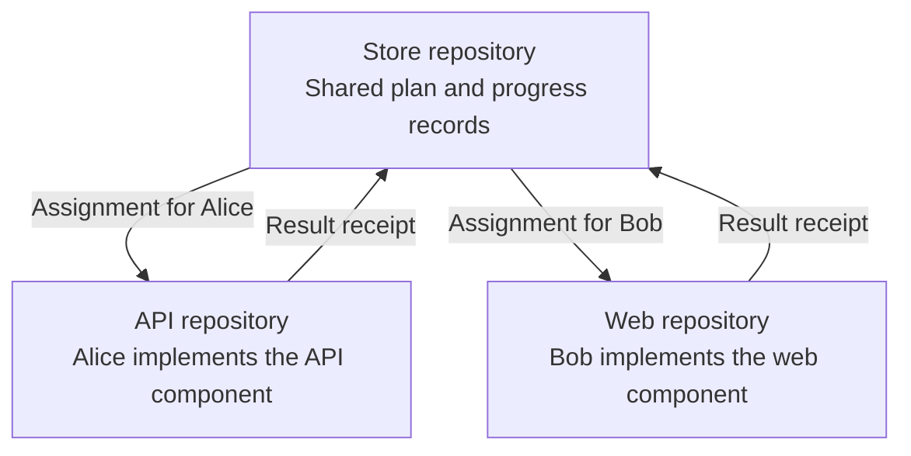
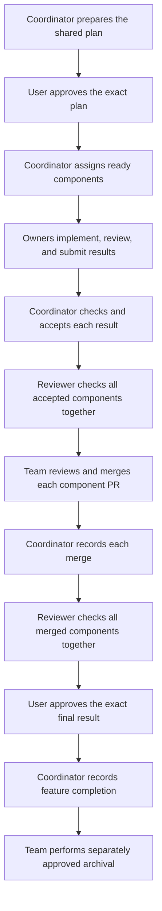
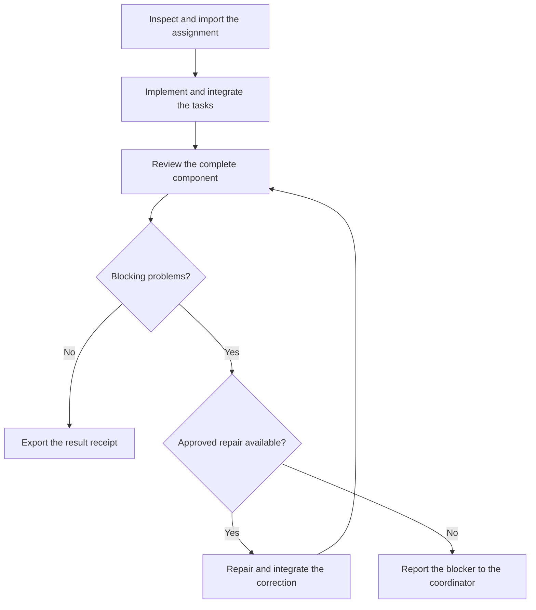
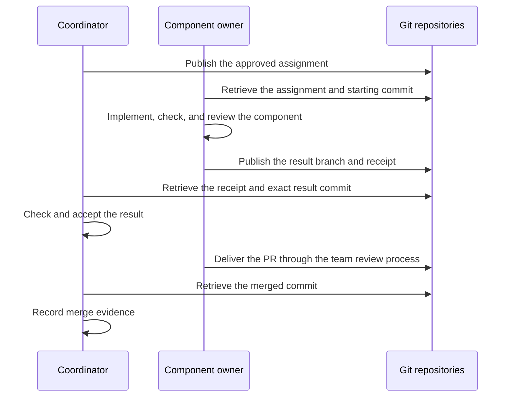
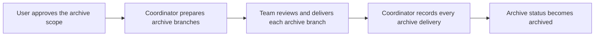

# Team workflow

Use this guide when one feature needs work in several repositories.
Each repository can have a different owner on a different machine.

The example feature adds a checkout discount.
Alice changes the API. Bob changes the web application.
One coordinator keeps the shared plan and progress records.

You use your agent to operate the runner.
This guide explains the decisions and results that you must understand.
For direct CLI operation, use the [operator reference](team-workflow-reference.md).

## Start here

1. Read [Roles and ownership](#roles-and-ownership).
2. Check [Before work starts](#before-work-starts).
3. Follow the [Complete team walkthrough](#complete-team-walkthrough).
4. Use [Status and completion](#status-and-completion) to understand progress.
5. Use [Changes, failures, and recovery](#changes-failures-and-recovery) if work stops.

## Roles and ownership

| Role | Responsibility |
|---|---|
| User | Approve the shared plan, the final result, and the archive scope. |
| Coordinator | Assign work, check submitted results, record merges, and track the whole feature. |
| Component owner | Implement one assigned component, review it, and submit its result. |
| Reviewer | Examine the specified result and report problems. |
| Agent | Run the commands for its role and explain the results. |

A person or an agent can act as the coordinator.
Each component owner remains responsible for the assigned work.
Your team controls Git access and PR review.
An owner name in a runner record identifies responsibility; it does not give Git access.

### Terms used in this guide

| Term | Meaning |
|---|---|
| Feature | The complete change that the user wants. |
| Component | The part of the feature implemented in one repository. |
| Store | A Git repository that holds the shared plan and team progress records. |
| Shared contract | The agreed requirements that all components must follow. |
| Assignment | A fixed work package for one component and one owner. |
| Receipt | A file that identifies the assignment, result, review, and check evidence. |
| Delivery branch | The branch that must receive a component result. The plan names this branch. |
| Pull request (PR) | A request to review and merge a branch through your team's Git process. |
| Blocker | A condition that prevents the next step. |
| Archive | The OpenSpec changes that update specifications and remove the completed change from active planning. |

The Store holds shared records.
The API and web repositories hold the implementation.
Each machine uses its own local paths to these repositories.

Each assignment specifies the starting commit, tasks, agent settings, checks, and shared contract version.
The owner works from that assignment.
A later Store update does not silently change assigned work.

## Before work starts

Ask the coordinator to confirm these items:

- Each machine has the runner, Git, OpenSpec, and an authenticated supported agent.
- Each component repository has the runner skills installed.
- The shared plan and each component plan are committed to Git.
- The plan names each component repository and delivery branch.
- The team identifies the owner for each component.
- The plan specifies dependencies, checks, agent settings, and repair limits.
- Each machine can locate its Store and component checkouts.
- The team has agreed how to publish branches, exchange receipts, and review PRs.

The coordinator uses a manifest to describe the feature.
A local map connects repository names to checkout paths on each machine.
The agent prepares these files. You review their meaning.

For installation, use the [user guide](user-guide.md#install-and-initialize).
For input formats, use the [operator reference](team-workflow-reference.md#complete-input-schemas).

## Complete team walkthrough

The process has two reviews of the complete feature.
The first review uses the accepted component results before delivery.
The final review uses the actual merged results.

The diagram shows the successful path.
A failed check or blocking review problem stops progress at that step.
The responsible owner repairs the problem within the approved scope and repair limit.
A scope change or exhausted repair limit needs user direction.

### 1. Approve the shared plan

**Responsible: coordinator and user.**

The coordinator prepares a preview of the committed plan.
The preview identifies the exact versions that you will approve.

Check these items:

- The required behavior of the complete feature.
- The work assigned to each component.
- The dependencies between components.
- The agent settings and repair limits.
- The checks that must pass.
- The delivery branch for each component.

Approve the plan when these items are correct.
The coordinator then records your approval.

**Result:** one approved plan for the whole feature.

### 2. Assign each ready component

**Responsible: coordinator.**

The coordinator creates an assignment for each ready component.
An assignment covers the whole component, including its local implementation tasks.

Independent components can start at the same time.
A dependent component must wait for the required upstream result.
The plan specifies whether that result must be accepted or merged.

**Example:** Bob needs Alice's accepted API result before he can start the web component.
The coordinator waits for API acceptance before assigning Bob's work.
Bob's assignment identifies the exact API commit to use.

**Result:** each owner receives a fixed assignment and the information needed to retrieve it.

### 3. Implement and review the component

**Responsible: component owner and local agent.**

The owner retrieves the assignment and inspects its contents.
The local agent imports the assignment into the component repository.
The agent then executes the assigned tasks.

After task integration, the agent requests a fresh component review.
The owner must resolve blocking problems before submitting a completed result.

**Result:** a reviewed result branch and a receipt, or a receipt that explains blocked or failed work.

### 4. Submit and accept the result

**Responsible: component owner, then coordinator.**

The owner publishes the result branch in the component repository.
The owner publishes the exact receipt on a separate Store submission branch.
The coordinator retrieves both items.

The receipt tells the coordinator which result to check.
The coordinator records the receipt and then checks the result independently.
Receipt import and result acceptance are separate actions.

Acceptance checks the assignment, completed tasks, review, and approved verification results.
The result must match the approved plan and contract.

**Result:** the coordinator accepts the exact component commit, or reports a blocker.

### 5. Review the components together

**Responsible: coordinator and reviewer.**

After every component is accepted, a reviewer examines the components together.
The coordinator runs the approved checks for this exact set of commits.

For the checkout example, the review checks that the API and web application follow the same discount rules.
The team must resolve blocking problems before delivery.

**Result:** the accepted components are ready for delivery when the review and checks pass.

### 6. Merge and record delivery

**Responsible: PR reviewers, component owners, and coordinator.**

The team reviews and merges each PR into its declared delivery branch.
The coordinator retrieves the merged commits and records the merge evidence.

The runner records delivery evidence supplied by the team.
It does not merge PRs or check a hosting service's live PR status.

A squash or rebase can change the delivered result.
If delivery differs from acceptance, the coordinator must arrange fresh checks and review of the delivered commit.

**Result:** every required component has a recorded merge on its delivery branch.

### 7. Approve feature completion

**Responsible: reviewer, coordinator, and user.**

A reviewer examines the exact set of merged component commits.
The coordinator runs the final approved checks.

Ask the coordinator to show:

- The merged commit and delivery branch for each component.
- The final check results.
- The final review and any remaining findings.
- The exact result that needs your approval.

Approve completion after the final checks and review pass.
The coordinator records your approval for that result.

**Result:** the shared feature is completed. Archive work can still be pending.

## Team interaction

The team exchanges Git branches and receipt files.
The runner does not fetch or push them automatically.
Your agent can perform the agreed Git steps when you authorize that work.

The coordinator needs the committed result and receipt.
The coordinator does not need the owner's session files.
Keep local logs and work directories if an operation needs recovery.

## How to ask your agent for help

Use the installed skill for your role.
In Codex, use `$openspec-runner-coordinate` or `$openspec-runner-component`.
In Claude Code, use `/openspec-runner-coordinate` or `/openspec-runner-component`.

Give the coordinator the feature name and local repository paths.
Give the owner the feature name, assignment ID, owner name, repository name, and checkout paths.
Replace the example names and paths below with your values.

**Coordinator request:**

> Use $openspec-runner-coordinate for checkout-promo. The Store is at /work/team-contracts.
> The API checkout is /work/checkout-api. The web checkout is /work/checkout-web.
> Show the shared plan, dependencies, checks, and delivery branches before plan approval.

**Owner request:**

> Use $openspec-runner-component for checkout-promo. I am Alice, the API owner.
> My assignment ID is assignment-alice-v1. My repository name is api.
> The Store is at /work/team-contracts. My API checkout is /work/checkout-api.
> Inspect the assignment and explain the work. Then execute the approved work and prepare the result receipt.

**Progress request:**

> Show the current feature status. Explain each blocker and the next action for each owner.

These are requests to your agent.
For direct commands and required inputs, use the [operator reference](team-workflow-reference.md#command-reference).

## Status and completion

Ask your agent to explain the status in these terms:

| Status | Meaning | Next step |
|---|---|---|
| Awaiting approval | The current shared plan needs approval. | Review the plan. |
| Implementing | One or more component results still need acceptance. | Check assignments, owner progress, and submitted results. |
| Verifying | The accepted components need a combined review and checks. | Review the components together. |
| Ready for delivery | The combined review and checks passed. | Deliver the component PRs. |
| Awaiting merges | Some required merges remain unrecorded. | Merge the remaining PRs and record evidence. |
| Final verification | The merged results need final checks and review. | Check the actual delivered feature. |
| Awaiting final approval | The current final result passed review and checks. | Review the completion preview. |
| Completed | The coordinator recorded user approval of the final result. | Check archive progress. |

An owner can finish implementation while the feature still needs acceptance, merges, or final approval.
Shared task checkboxes follow recorded merge and final verification milestones.
Owner progress alone does not complete shared tasks.

Status describes the Store history available on the local machine.
Ask the agent to retrieve the agreed current history before using status for a team decision.

## Post-merge archival

Archive work has its own approval and delivery process.
You can approve the exact archive scope with completion or approve it separately afterward.

The scope identifies the component changes and whether it includes the shared Store change.
Ask the coordinator to show the affected repositories, paths, and target branches.

| Archive status | Meaning |
|---|---|
| Pending | Archive preparation has not completed. |
| Prepared | Archive branches exist, but required delivery records are incomplete. |
| Archived | Every approved archive target has a recorded delivery. |

A prepared archive branch still needs delivery to its target branch.
Feature completion and archive completion are separate facts.

Store archival currently requires the shared change at `openspec/changes/<shared-change>` in the Store repository root.
For a nested planning root, ask the coordinator to explain the supported alternatives before archive approval.

## Changes, failures, and recovery

Ask for status before repeating a failed action.
Keep the original assignment, receipt, operation records, logs, and work directories.

| Situation | What to do |
|---|---|
| The owner cannot continue. | Ask the owner to submit a blocked or failed receipt with a specific reason. |
| The owner changes. | Ask the coordinator to revoke the old assignment and issue a replacement. |
| The approved plan or settings change. | Review and approve the revised shared plan before work continues. |
| A review finds blocking problems. | Ask the responsible owner to repair them within the approved limit. |
| A repair limit is reached. | Give the coordinator direction before further repair work. |
| Publication fails. | Keep the original receipt and result branch. Ask the agent to inspect Git history before retrying publication. |
| A command stops unexpectedly. | Ask the agent to inspect its saved state before retrying the original operation. |
| A delivered result differs from the accepted result. | Ask for fresh checks and review of the exact delivered commit. |
| The merged results change after completion. | Request a new final review and completion approval for the changed result. |
| Archive preparation or delivery stops. | Ask the coordinator to inspect archive progress and recover the affected target. |

A replacement assignment needs a fresh independent component clone.
A new worktree in the old clone shares its assignment state.
Ask your agent to prepare the replacement clone and retain the old recovery evidence.

Shared plan approval renewal affects the whole feature.
The coordinator must check every component's assignment and result after renewal.
Old final review and completion approval do not carry forward automatically.

For exact recovery commands, use the [operator reference](team-workflow-reference.md#changes-failures-and-recovery).

## Further reading

- [User guide](user-guide.md): installation and work in one repository.
- [Operator reference](team-workflow-reference.md): command sequences, schemas, and recovery details.
- [Input builder](examples/linked-feature-inputs.mjs): files for direct CLI operation.

This guide uses short sentences, active instructions, and defined technical terms based on
[ASD-STE100 Simplified Technical English](https://www.asd-ste100.org/about_STE.html).
