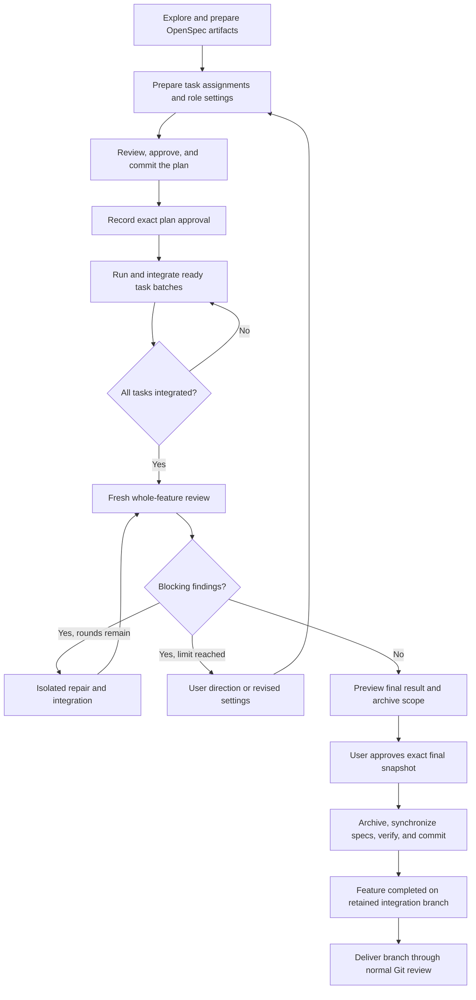
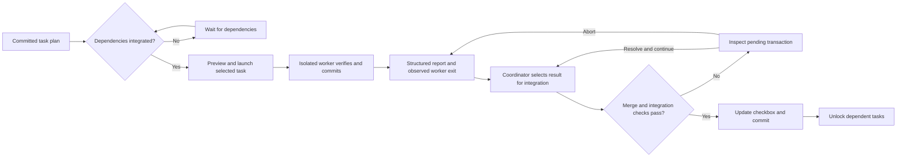

# User guide

This guide covers the current openspec-runner CLI. It takes you from installation
through planning, isolated implementation, integration, review, recovery, and
delivery. The [team workflow guide](team-workflow.md) describes the proposed
extension for shared Stores and teammates on different machines.

## Contents

- [Choose a workflow](#choose-a-workflow)
- [Install and initialize](#install-and-initialize)
- [Understand the files and roles](#understand-the-files-and-roles)
- [Configure execution](#configure-execution)
- [Run a managed feature](#run-a-managed-feature)
- [Run unmanaged batches](#run-unmanaged-batches)
- [Task execution and integration](#task-execution-and-integration)
- [Read status and results](#read-status-and-results)
- [Resume, recover, and change a plan](#resume-recover-and-change-a-plan)
- [Clean up and deliver](#clean-up-and-deliver)
- [Troubleshooting](#troubleshooting)

## Choose a workflow

OpenSpec describes the intended behavior and implementation plan. The runner
executes its numbered tasks and records enough state to resume and review the
work. Your coordinating agent uses the installed skills to operate the CLI.

| Workflow | Choose it when | Approvals | Result |
|---|---|---|---|
| Managed feature | You want implementation, whole-feature review, bounded repairs, and archival tracked together | Approve the committed plan and role settings, then the exact final result and archive scope | Reviewed, archived integration branch |
| Unmanaged batches | You want to select and approve batches and integrations individually | Approve each launch and integration; archive manually | Retained integration branch with completed tasks |
| Proposed shared feature | Several repositories and owners implement a Store contract | Shared snapshot approval, component acceptance, and final merged-result approval | Completion after every required component PR merges |

Managed plan approval authorizes routine execution within that approved scope.
A revised plan or execution setting requires review of a new snapshot. A preview
token identifies the snapshot you approved; it does not establish consent.

### Managed feature SDLC



The last delivery step is explicit. The current managed feature completion
records archival on the integration branch; it does not merge that branch into
your main branch. The proposed team mode uses a later completion milestone.

## Install and initialize

You need Linux, macOS, or WSL, Node.js 22.13 or newer, Git, an initialized
OpenSpec project, and an installed, authenticated Codex or Claude Code harness.
Worktrunk, Herdr, and Orca are optional. See the [requirements](../README.md#requirements)
for supported environments and integrations.

From your openspec-runner checkout, build and expose the local CLI:

```sh
pnpm install --frozen-lockfile
pnpm run build
pnpm add --global .
openspec-runner --help
```

Then, inside the target project's Git repository:

```sh
openspec-runner init --agent all
```

Use `--agent codex` or `--agent claude` to install only that harness's skills.
If you prefer a local project dependency, follow the
[installation alternatives](../README.md#install-into-a-target-project).

`init` creates the runner configuration when absent and installs runner-owned
skills. Read the configuration before committing it. OpenSpec initialization and
the harness's authentication remain separate setup steps.

## Understand the files and roles

| Location | Purpose |
|---|---|
| `openspec/changes/<change>/` | OpenSpec proposal, design, specifications, and task plan |
| `tasks.md` | Numbered canonical task checkboxes |
| `execution.yaml` | Dependencies, parallel permission, and task model settings |
| `openspec/runner.yaml` | Harnesses, concurrency, setup, checks, and adapters |
| Git common directory, under `openspec-runner/` | Runtime attempts, reports, locks, and managed lifecycle records |
| Runner-owned integration worktree | Sequentially integrated results and canonical checkbox updates |
| Runner-owned task/review/repair worktrees | Isolated implementation and verification resources |

The planning artifacts may begin uncommitted. Commit the complete reviewed plan
before launching work. Runtime state is maintained by the runner outside the
versioned planning artifacts.

| Skill | Use it for |
|---|---|
| `openspec-runner-plan` | Exploring the problem and preparing artifacts, assignments, and approval settings |
| `openspec-runner-coordinate` | Selecting ready work and resuming implementation, integration, review, and repairs |
| `openspec-runner-implement` | One runner-assigned task worker |
| `openspec-runner-review` | A fresh whole-feature reviewer |
| `openspec-runner-repair` | An isolated attempt to address blocking findings |

In Codex, invoke a skill with `Use $openspec-runner-plan ...`. In Claude Code,
use `/openspec-runner-plan ...`. Worker skills receive their scope and identity
through runner-generated prompts.

## Configure execution

The default project configuration is suitable for Codex batches:

```yaml
version: 1
defaultModel: session
maxParallel: 4
worktrees: auto
terminal: auto
cleanup: automatic
setup: []
verifyIntegration: []
```

Set `setup` to idempotent argument-array commands required in new worktrees.
Set `verifyIntegration` to checks that validate the merged result. For example,
a project using pnpm could configure its own install and test scripts there.
Checks must leave the integration checkout in a state the runner can verify.

Put task assignments beside `tasks.md`:

```yaml
version: 1
tasks:
  "1.1":
    parallel: true
  "1.2":
    parallel: true
  "2.1":
    dependsOn: ["1.1", "1.2"]
    parallel: false
```

Every checkbox requires a unique numbered identifier such as `1.1` and a
description. Assignments must cover the plan. Dependencies must exist and form
an acyclic graph. Tasks default to exclusive execution; overlapping tasks must
each permit parallel execution. Reserved attempts consume concurrency slots.

Version 2 supports registered harness configuration and change-level harness
selection. Use the [configuration reference](../README.md#configuration) for
Claude settings, model discovery, approval inputs, adapter selection, and
version compatibility. Managed role settings use explicit discovered models;
they do not adopt new session defaults when another coordinator resumes.

## Run a managed feature

The example change is `user-auth`. Run commands inside the target project unless
the runner returns a specific worker or integration path.

### 1. Register and plan

```sh
openspec-runner feature start user-auth --json
```

This can happen before the OpenSpec artifacts exist. To enroll an idle change
that already has runner task state, use `feature adopt` instead of `feature start`.

Ask the planning skill to prepare the managed feature. For example, in Codex:

```text
Use $openspec-runner-plan for user-auth as a managed feature. Prepare the OpenSpec
artifacts, task dependencies, safe parallel groups, and explicit implementation,
review, and repair settings. Save the role settings to /tmp/user-auth-settings.json.
Present the complete plan for approval before implementation.
```

Review scope, acceptance criteria, dependencies, checks, harness/model settings,
and the repair limit. Commit the approved artifacts before recording approval.
The default limit is two repair attempts.

### 2. Record the approved snapshot

```sh
openspec-runner feature approve user-auth --file /tmp/user-auth-settings.json --dry-run --json
```

Read the resolved snapshot and confirm it matches the package you approved.
Replace `PLAN_TOKEN` below with that preview's token after giving consent:

```sh
openspec-runner feature approve user-auth --file /tmp/user-auth-settings.json --confirm PLAN_TOKEN --json
```

### 3. Execute ready batches

```sh
openspec-runner feature status user-auth --json
openspec-runner launch user-auth --tasks 1.1,1.2 --dry-run --json
openspec-runner launch user-auth --tasks 1.1,1.2
```

Select only ready tasks. The example pair is valid when both are ready, both
permit parallel execution, and capacity is available. Managed launches use the
approved settings. In manual terminal mode, run each returned supervised worker
command once in its own terminal.

After the workers report and exit successfully:

```sh
openspec-runner integrate user-auth --tasks 1.1,1.2
```

Inspect status and continue with newly ready tasks. The coordinating skill can
perform this loop within the approved scope; the CLI does not run an unattended
scheduler.

### 4. Review and repair

```sh
openspec-runner feature review user-auth --dry-run --json
openspec-runner feature review user-auth --json
openspec-runner feature status user-auth --json
```

Correctness, security, spec, and verification findings block final approval.
Advisory findings remain visible. If there are blockers and repair rounds remain:

```sh
openspec-runner feature fix user-auth --dry-run --json
openspec-runner feature fix user-auth --json
```

Wait for the repair's report and successful supervised exit. Replace `REPAIR_ID`
with the returned attempt ID:

```sh
openspec-runner feature integrate user-auth --attempt REPAIR_ID --json
openspec-runner feature review user-auth --json
```

A repair makes the previous review stale. The new review determines whether the
blocking findings were resolved. Reaching the repair limit requires user
direction or reviewed settings with a larger limit.

### 5. Approve and archive

```sh
openspec-runner feature approve user-auth --final --dry-run --json
openspec-runner feature archive user-auth --dry-run --json
```

Review the exact integration commit, latest review, checks, advisory findings,
and archive scope. After approval, replace `FINAL_TOKEN` with the final preview's
token and run:

```sh
openspec-runner feature approve user-auth --final --confirm FINAL_TOKEN --json
openspec-runner feature archive user-auth --json
```

Archival synchronizes OpenSpec specs, commits the archive, and runs final checks.
The completed feature remains on its integration branch, ready for explicit
delivery through your normal Git review process.

## Run unmanaged batches

Use the planning skill to prepare and commit the OpenSpec artifacts and
`execution.yaml`. For each batch:

```sh
openspec-runner status user-auth --json
openspec-runner launch user-auth --tasks 1.1,1.2 --dry-run --json
```

Approve the preview, launch that exact batch, and inspect its reports and exits.
Approve integration separately:

```sh
openspec-runner launch user-auth --tasks 1.1,1.2
openspec-runner integrate user-auth --tasks 1.1,1.2
```

Repeat with newly ready tasks. Select the harness and any session model defaults
in the preview before approving a launch. Deliver the completed integration
branch and archive through your normal OpenSpec workflow.

## Task execution and integration



A worker's completed report does not satisfy dependencies. Only successful
integration updates the canonical checkbox. A failed merge or check leaves a
recoverable transaction and keeps dependent tasks blocked.

## Read status and results

For a managed feature, start with `feature status <change> --json`; it works
before artifacts exist and after archival. For unmanaged execution, use
`status <change> --json`. Look for the current phase, blocker, next action,
task readiness, attempts, integration path, review findings, and cleanup results.

Before integration, inspect the task identity, actual session, outcome, full
commit SHA, clean worktree, verification evidence, and observed supervised exit.
When a task reports `blocked` or `failed`, use its concrete reason to decide
whether to retry, revise the plan, or supply missing input.

Cleanup results are separate from integration success. A resource cleanup failure
can leave a successful task integrated and its worktree retained for inspection.

## Resume, recover, and change a plan

| Situation | Action |
|---|---|
| New coordinating session | Inspect status and resume from the recorded next action. Managed settings remain frozen. |
| Task preparation interrupted before a session starts | Use `recover <change> <task>` after inspecting the attempt. |
| Worker failed or was blocked | Inspect its report, then explicitly use `retry <change> <task>` when appropriate. |
| Task merge conflicted or checks failed | Inspect the returned integration path, resolve and stage the needed changes, then use `integrate <change> --continue`. |
| Abandon the current pending task merge | Use `integrate <change> --abort`; earlier integrations and task branches remain. |
| Repair integration interrupted | Use `feature integrate <change> --continue` or `--abort` after inspection. |
| Feature supervisor disappeared | Use `feature recover <change> --attempt ID` to record the interruption without blindly redispatching it. |
| Planning artifacts changed | Commit the revised plan, stop/report active workers, reconcile it, and obtain a new managed plan approval. |
| Archive command interrupted | Inspect its durable receipt and filesystem result, then resume with `feature archive <change>`. |

Read the [recovery reference](../README.md#recovery-and-plan-changes) for cases
involving partial archive edits, uncertain process ownership, and interrupted
commits. The repository lock records its owner; lock removal requires confirming
that owner is gone. Preserve runtime history while recovering.

## Clean up and deliver

Automatic cleanup removes eligible runner-owned task resources after successful
integration. Inspect retained candidates with:

```sh
openspec-runner cleanup user-auth --all --dry-run --json
```

Dirty, locked, or otherwise reviewable resources require approval bound to the
current inspection. Use the returned attempt ID and token with the
[cleanup command](../README.md#worktree-and-terminal-cleanup). Review and repair
worktrees are retained for inspection.

Use the integration branch and full commit returned in status as the delivery
source. Your invoking checkout may still be on its original branch. Publish and
review the intended integration branch through your team's Git workflow.

## Troubleshooting

| Symptom | First check |
|---|---|
| Plan cannot launch | Confirm OpenSpec readiness, committed artifacts, task numbering, and assignment coverage. |
| Dependency still blocked | Check that the prerequisite was integrated, rather than only reported completed. |
| No worker terminal opened | Check the selected terminal adapter; manual mode returns commands to run yourself. |
| Capacity already consumed | Inspect reserved attempts before issuing another launch. |
| Model resolution failed | Use `models --agent HARNESS --json` and review the configured/approved settings. |
| Integration rejected a result | Inspect session/worktree identity, full commit, clean state, planning drift, and exit evidence. |
| Final approval unavailable | Check all tasks, the latest fresh review, blocking findings, and required checks. |
| Worktree remains after integration | Inspect the independent cleanup outcome and any confirmation requirement. |

For detailed diagnostics and all supported flags, use the
[troubleshooting guide](../README.md#troubleshooting) and
[current CLI reference](../README.md#cli-reference).
